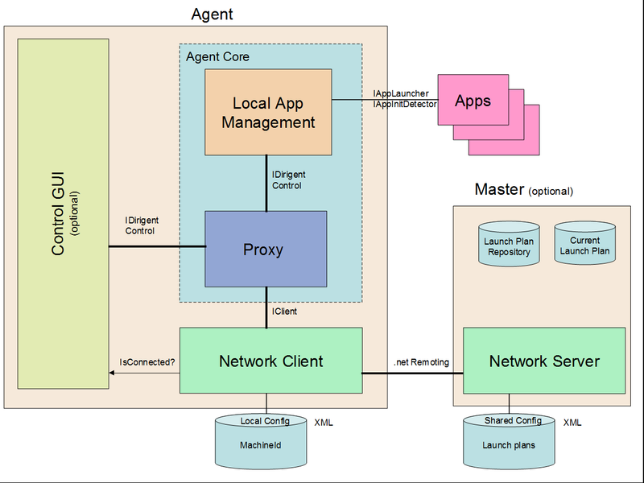

## Dirigent Overview
Dirigent is an application life cycle management and diagnostic tool. It allows launching a given set of applications in given order on given computers according to a predefined launch plan. It runs on Windows platform with .net 3.5.

#### Launch plans

The plan specifies what applications to launch, on what computers, in what order and what another apps (dependencies) need to be running and initialized prior starting a given application.

The dependencies are checked among both local and remote applications. 

#### Individual applications control
Applications can be launched, terminated or restarted, either individually or all-at-once.

An application that is supposed to run continuously can be automatically restarted after unexpected termination or crash.

#### Application status sharing
The applications are continuously monitored whether they are already initialized and still running. Their status is distributed to all agents on all machines.

#### Launching apps at startup
A launch plan can be executed automatically on computer startup.

To speedup the boot process of a system comprising multiple interdependent computers, certain applications (independent on those on other computers) can be launched even before the connection among computers is established.

#### Ways of control
All operations can be controlled

 * from any computer via a control GUI

 * from a command line tool or

 * programmatically via a .net library.
 
#### Local and networked mode
Dirigent can be configured to to run either in single-machine or networked mode, with embedded control GUI or as GUIless background process (daemon), or as a command line control application.

#### Architecture

Each computer is running an agent process. One of the computers runs a master server process. Agents connect to a single master. The master's role is to broadcast messages from agents to all other agents and share the launch plans (stored in shared config).

Agent manages the processes running locally on the same machine where the agent is running. Agent takes care of local application launching, killing, restarting and status monitoring. 

An agent listens to and executes application management commands from master.

Agents publish the status of local applications to master which in turn spreads it to all other agents. The status include whether the app is running, whether it is already initialized etc.

All agents share the same configuration of launch plans - each one knows what applications the others are supposed to run.

The master inform agents about the current launch plan automatically when the agent connects to the master.

The shared configuration file can be present either just on master or an identical copy of it must be present on every agent.

## Usage

### Basic steps

#### Configure launch plans
Define launch plans, i.e. what apps to start on what computer in what order. Store it into a `SharedConfig.xml` config file next to `Dirigent.Master.exe`.

For example the following plan opens a notepad app first on machine `m1` with file `c:\aaa.txt`. Then, in 2 seconds from launching the notepad on machine m1, it opens another notepad on machine `m2` with file `c:\bbb.txt`. Because of the dependency between those apps, the second notepad won't be launched if the first notepad doesn't start (from any reason).

    <?xml version="1.0" encoding="UTF-8"?>
    <Shared>
        <Plan Name="plan1">
            <App
                AppIdTuple = "m1.a"
                Template = "apps.notepad"
                StartupDir = "c:\"
                CmdLineArgs = "aaa.txt"
                >
                <Env>
                  <Set Variable="TEMP" Value="C:\TEMP" />
                  <Path Prepend="C:\MYPATH" /> 
                </Env>
                <WindowPos TitleRegExp="\s-\sNotepad" Rect="10,50,300,200" Screen="1" Keep="0" />
            </App>
    
            <App
                AppIdTuple = "m2.b"
                Template = "apps.notepad"
                StartupDir = "c:\"
                CmdLineArgs = "bbb.txt"
                Dependencies = "m1.a"
            />
        </Plan>
    
        <AppTemplate Name="apps.notepad"
                Template = ""
                ExeFullPath = "c:\windows\notepad.exe"
                StartupDir = "c:\"
                CmdLineArgs = ""
                StartupOrder = "0"
                RestartOnCrash = "1"
                SeparationInterval = "0.5"
            <InitDetectors>
              <WindowPoppedUp TitleRegExp="\s-\sNotepad"/>
              <TimeOut>5.0</TimeOut>
            </InitDetectors>
        />
    
    </Shared>

Deploy this config file to all agents if you want agents to start their plans without first waiting for master. All agents should use identical shared configuration file.

#### Setup a master
Start a master process on one of the machines. Master is not necessary in single-machine mode of operation.

On master machine:

    Dirigent.Master.exe --masterPort 5045 --startupPlan plan1
	
	
Alternatively, you can configure one of the dirigent agents to run the master process automatically. See the --IsMaster command line argument of Diregent.Agent process.

#### Deploy agents
On each machine install an agent application.

Assign a unique machineId to each agent so it could identify its application in the launch plan.

You can specify the IP address and port of the master and machineId of in the local configuration of each respective agent.

On first machine:

    Dirigent.Agent.exe --machineId m1 --mode trayGui --startHidden 1 --masterIp 10.1.1.2 --masterPort 5045

On second machine:

    Dirigent.Agent.exe --machineId m2 --mode trayGui --startHidden 1 --masterIp 10.1.1.2 --masterPort 5045

#### Load and start a launch plan
Select a launch plan to start, issue a Select Plan command followed by a Start Plan command.

For example using a command ling control app:

    Dirigent.AgentCmd.exe --masterIp 10.1.1.2 --masterPort 5045 StartPlan plan1

Multiple commands can be executed at once if separated by a semicolon. For example  

    Dirigent.AgentCmd.exe --masterIp 10.1.1.2 --masterPort 5045 Start plan1; StartPlan plan2

    
### Available Actions
The Dirigent can work either with whole launch plan or with an individual application that is part of the currently selected launch plan.

#### Launch Plan Actions

 - **Select Plan.** The given plan becomes the current plan. New apps defined by this plan are added to the list of operated ones. This affects only the local agent where the command is issued.

 - **Start Plan.** Apps from the current plan start to be lauched according to the plan.

 - **Stop Plan.** Stop launching of apps from the current plan. No apps are killed.

 - **Kill Plan.** All apps that are part of the current lauch plan are killed.

 - **Restart Plan.** All apps from the current plan are first killed and then the plan starts.

#### Individual Apps Actions

 - **Kill App.** The app is killed immediately if already running. The auto-restart (if configured) is disabled so that the app stays killed and is not started again automatically.

 - **Launch App.** The app is launched if not already running, ignoring any dependency checks.

 - **Restart App.** The app is first killed and then launched again.

### Agent configuration options
`Diregent.Agent.exe` is a Windows Forms application capable of running either as a background process with no user interface (just the log file) or as a GUI application that can be minimalized into a system tray.

The options can be specified either on the command line (prefixed with double dash `--`, for example `--optionName`) or in the `agent.config` file located next to the agent executable.

#### Specifying the machine name

The applications are supposed to run on a specific computer. More precisely, to be launched by an agent configured to the same machine id as the application.

 `--machineId m1` ...id of the computer where the agent is running on

#### Operation mode selection

The following options changes the mode of operation:

 `--mode deamon|trayGui|remoteControlGui` .... select mode of operation
 
 - `deamon` ... no user inteface at all, just a log file
     
 - `trayGui` ... an icon in tray with gui control app accessible from the context menu; the default
     
 - `remoteControlGui` ... not agent as such (not directly managing any local apps), just a remote control GUI that monitors the apps and remotely send commands to the agents
 
`--startHidden 0|1` .... start minimized (only works with `--trayGui` and `--remoteControlGui`)

#### Another options

 `--masterPort 5042` ... mater's port number

 `--masterIp 1.2.3.4` ... mater's IP address

 `--logFile xyz.log` ... what log file to use

 `--startupPlan <plan_name>` ... immediately loads an initial plan and makes it the current one (local agent) before the connection to the master is estabilished

 `--sharedConfigFile mySharedConfig.xml` ... what shared config file to use
 
 `--isMaster 0|1` .... start master process automatically (no need to run it separately then)

 `--CLIPort 5050` ... Command Line Interface port number. Passed to the master process when `--IsMaster 1` is used.

### Master configuration options
`Dirigent.Master.exe` is a console application designed to run in background on one of the computers.

 `--masterPort 5042` ... what TPC port to run on

 `--logFile xyz.log` ... what log file to use

 `--sharedConfigFile mySharedConfig.xml` ... what shared config file to use

 `--startupPlan <plan_name>` ... what plan to be forced (make selected) on agents when they connect to master

 `--CLIPort 5050` ... what TPC port to run the Command Line Interface server on

### Agent Command Line Interface over TCP line-based connection

Master is running a TCP server providing for controlling agents' operations.

TCP server allows multiple simultaneous clients. Server accepts single text line based requests from clients. Line separation character is `\n`. For each request the server sends back one or more status reply lines depending on the command type. Each request can be optionally marked with request id which is then used to mark appropriate response lines. Requests are buffered and processed sequentially, response may come later. Clients do not need to wait for a response before sending another request.

##### Request line format:
  `[optional-req-id] request command text till the end of line\n`
  
##### Response line format:
  `[optional-req-id] response text till the end of line\n`

##### Request commands
  `StartPlan <planName>` .... starts given plan, i.e. start launching apps
  `StopPlan <planName>` ..... stops starting next applications from the plan
  `KillPlan <planName>` ..... kills given plans (kills all its apps)
  `RestartPlan <planName>` .. stops all apps and starts the plan again
   
  `LaunchApp <appId>` ....... starts given app
  `KillApp <appId>` ......... kills given app
  `RestartApp <appId>` ...... restarts given app
  
  `GetPlanState <planName>`  returns the status of given plan
  `GetAppState <planName>`   returns the status of given app
  
  `GetAllPlansState` ..... returns one line per plan; last line will be "END\n"
  `GetAllAppsState` ...... returns one line per application; last line will be "END\n"

##### Response text for GetPlanState
  `PLAN:<planName>:None`
  `PLAN:<planName>:InProgress`
  `PLAN:<planName>:Failure`
  `PLAN:<planName>:Success`
   
##### Response text for GetAppState
  `APP:<AppName>:<Flags>:<ExitCode>:<StatusAge>:<%CPU>:<%GPU>:<MemoryMB>`
  
###### Flags
   Each letter represents one status flag. If letter is missing, flag is cleared.
  `S` = started
  `F` = start failed
  `R` = running
  `K` = killed
  `I` = initialized
  `P` = plan applied
  
###### ExitCode
  Integer number	if exit code (valid only if aff has exited, i.e. Started but not Running)
###### StatusAge
  Number of seconds since last update of the app state
###### CPU
  Integer percentage of CPU usage
###### GPU
  Integer percentage of GPU usage
###### MemoryMB
  Integer number of MBytes used

##### Response text for other commands
  `ACK\n` ... command reception was acknowledged, command was issued
  `ERROR: error text here\n`
  `END\n` ..... ends the list in case the command is expected to produce multiple line response

###### Using request id
  Request:   `[001] StartPlan plan1`
  Response:	 `[001] ACK`

###### Leaving out the request id
  Request:   `KillPlan plan2`
  Response:	 `ACK`

###### Wrong identifier
  Request:   `KillPlan invalidPlan1`
  Response:	 `ERROR: Plan 'invalidPlan1' does not exist`

###### Starting an application
  Request:   `[002] StartApp m1.a`
  Response:	 `[002] ACK`

###### Getting plan status
  Request:   `[003] GetPlanStatus plan1`
  Response:	 `[003] PLAN:plan1:InProgress`

###### Getting app status
  Request:   `GetAppStatus m1.a1`
  Response:	 `APP:m1.a:SIP:255:10:34:0:7623`

### Agent Console Command Line Utility

There is a small executable specialized for sending commands to agents. It connects to the master and send a command specified on the command line.
 
 `Dirigent.AgentCmd.exe <command> <arg1> <arg2> ...`
 
Zero exit code is returned on success, positive error code on failure.

The commands just simply follow the available agent actions, please see chapter *Available Actions* for more details.

    StartPlan <planId>
    StopPlan <planId>
    KillPlan <planId>
    RestartPlan <planId>

    LaunchApp <appId>
    KillApp <appId>
    RestartApp <appId>

Multiple commands on a single line can be separated by semicolon
	`Diregent.AgentCmd.exe LaunchApp m1.a;StartPlan plan1`

 
## Configuration

Dirigent configuration comprises of two parts - a shared configuration  and a local configuration.

Shared configuration is shared among all agents. It specifies the launch plans but can be used also for another information like the names of all the machines involved etc.

Local configuration defines the network settings and operation mode details of a single agent or master application.

### Shared config
Shared configuration is stored in the `SharedConfig.xlm` file. The location of the file can be set through application option `sharedConfigFile`.

#### Launch plan

Launch plan comprises just a list of apps to be launched in given order. Multiple parallel plans can be active at a time.

Each app in the launch plan has the following attributes:

 - `AppIdTuple` - unique text id of the application instance; comes together with the machine id; format "machineId.appId"
 
 - `ExeFullPath` - application binary file full path; can be relative to the dirigent's shared config file location (or CWD if none defined). Environment variables in form of %VARNAME% are expanded using Agen't current environment.

 - `StartupDir` - startup directory; can be relative to the dirigent's shared config file location (or CWD if none defined). Environment variables in form of %VARNAME% are expanded using Agen't current environment.

 - `CmdLineArgs` - command line arguments

 - `StartupOrder` - the launch order in case of same priority of multiple apps

 - `Volatile 0|1` - whether the application is expected to terminate automatically and not stay forever until killed; Such apps are not part of plan start success condition.

 - `Disabled 0|1` - whether the application is initially excluded from plan operation.

 - `RestartOnCrash 0|1` - whether to automatically restart the app after crash

 - `AdoptIfAlreadyRunning 0|1` - whether not to start a new instance of a process if the process with same executable image name is already running

 - `Dependencies` - what apps is this one dependent on, ie. what apps have to be launched and fully initalized before this one can be started; semicolon separated AppIdTuples.

 - `InitCondition` - a mechanism to detect that the app is fully initialized (by time, by exit code etc.) See chapter *Selecting a boot up completion detector*. **DEPRECATED**, use the InitDetectors section instead.

 - `WindowStyle` - "normal" (default), "minimized", "maximized", "hidden"

 - `Template` - where to load default settings from; the name of a AppTemplate section in the same XML file

 - `KillTree 0|1` - whether to kill not just the single process but also all its child processes

 - `SeparationInterval <numseconds>` - how much time to wait before starting the next application
 
App sub-sections:

  - `WindowPos`
  
        <WindowPos TitleRegExp="\s-\sNotepad" Rect="10,50,300,200" Screen="1" Keep="0" /> 

    Finds a window belonging to the application by its title using regular expression search. Affects window settings (position, z-order etc.)
    
    The window must belong to the started process or to its first-level child processes. This allows for launching a batch file and starting the target process from there.
    
    There can be multiple WindowPos sections defined for one application.

    Attributes:
    
    - `TitleRegExp` - regular expression to search in the window title. This is the only mandatory attribute, the rest of attributes are optional.
    
    - `Rect` - desired screen coordinates [left,top,width,height] of the window relative to the given screen. All zeros means 'not set' and behaves as if not specified at all. 
    
    - `Screen` - screen number to place the window at; 0=main screen (default)
    
    - `Keep` - 0/1 whether to keep applying the coordinates in short regular intervals, i.e. to force the window to stay at given coordinates. If not set, the first successful search for
 
    - `SendToBack` - 0/1 whether to put window below all other windows, i.e. to avoid popping up
 
    - `BringToFront` - 0/1 whether to put window to the foreground and activate it; usefel in combination with Keep="1" to keep the window visible and focused
    
    - `TopMost` - 0/1 whether to make the window 'Always on top'
 
    - `WindowStyle` - "normal" | "minimized" | "maximized" | "hidden"

    If used in a template, the WindowPos definition is added to all application using this template.
    
 - `InitDetectors`
  
        <InitDetectors>
          <WindowPoppedUp TitleRegExp="\s-\sNotepad"/>
          <TimeOut>5.0</TimeOut>
        </InitDetectors>
        
    Defines a mechanism to detect that the app is fully initialized (by time, by exit code etc.) See chapter *Selecting a boot up completion detector*  
    
    If multiple detectors are defined, the first one whose condition is satified marks the app as initialized.

  - `Env`
  
        <Env>
          <Set Variable="TMP" Value="C:\TEMP" />
          <Set Variable="TEMP" Value="C:\TEMP" />
          <Path Prepend="C:\MYPATH1" Append="C:\MYPATH2"/> 
        </Env>

    Modifies the environment variables for the started process, taking the Diriget Agen't startup environment as a basis.
    
    Existing environment variables can be set to a new value. Non-existing will be created, existing will be overwritten.
    
    Specific support for PATH variable allows prepending or appending given string to PATH.
    
    Attributes:
    
    - `Set` - set given variable to a new value. Both attributes `Variable` and `Name` are mandatory. Environment variables in form of %VARNAME% contained in the Value are expanded using Agen't current environment.
    
    - `Path` - if attribute `Prepend` is present, prepends its value at the begining of the PATH variable. if attribute `Append` is present, appends its value at the end of the PATH variable. Environment variables contained in the `Prepend` or `Append` attribute values in form of %VARNAME% are expanded using Agen't current environment.
    
    
#### Templated launch plan definition

Plan definition in an XML file uses a template sections allowing the inheritance of attributes.

Every record in the plan can reference a template record.

All the attributes are loaded first from the template and only then they can get overwritten by equally named attributes from the referencing entry. 

A template record itself can reference another more generic template record.

#### Identifying an application

The application instance is uniquely addressed by the name of the computer it is running on and by the name chosen for particular instance of an application. These two are separated by a dot, having format `machineId.applicationInstanceId`.

The `machineId` is unique globally. 

The `applicationInstanceId` is unique within the launch plan where it is used.

#### Launch plan example
The following plan example specify two instances of a notepad editor, named `a` and `b`. Both are based on the same template `apps.notepad`, just with specific command line argument (different files to edit).

The apps will be run on a computer where the agent is configured to  machineId `m1`.

        <Plan Name="plan1">
            <App
                AppIdTuple = "m1.a"
                Template = "apps.notepad"
                StartupDir = "c:\"
                CmdLineArgs = "aaa.txt"
                >
                <WindowPos titleregexp="\s-\sNotepad" rect="10,50,300,200" screen="1" keep="0" />
            </App>
         
            <App
                AppIdTuple = "m1.b"
                Template = "apps.notepad"
                StartupDir = "c:\"
                CmdLineArgs = "bbb.txt"
            />
        </Plan>
        
        <AppTemplate Name="apps.notepad"
                Template = ""
                ExeFullPath = "c:\windows\notepad.exe"
                StartupDir = "c:\"
                CmdLineArgs = ""
                StartupOrder = "0"
                RestartOnCrash = "1"
                InitCondition = "timeout 2.0"
                SeparationInterval = "0.5"
        />

#### Selecting a boot up completion detector

Some apps take a long time to boot up and initialize. Dirigent should not start a dependent app until its dependecies are satisfied. By 'satisfied' it is meant that the all the dependencies are already running and that they have completed their initialization phase.

Dirigent supports multiple methods of detection whether an application is already up and running. The method together with its parameters can be specified for each application in the launch plan.

If not boot up completion detectors are defined, the app is considered initialized from the time it has been started. 

Following methods are available

 - `<timeout>seconds</timeout>` - After specified amount of seconds after launching the app

 - `<exitcode> <number></exitcode>` - After the app have terminated and its exit code matches the number specified. This can be combined with an auto-restart option of the application, resulting in a repetitive launches until given exitcode is returned.
 
#### Starting with local copy of Shared config
Before the agent connects to master, it is using its local copy of SharedConfig. This is useful if agent needs to start applications event before the connection to master is established.

#### Adopting master's plan upon connection
As soon as an agent connects to master, it receives and adopts the master's copy of the shared config. The local copy should be of course identical to the master's copy. If it is not, the currently running agent's plan is stopped, i.e. the all the apps launched by the agent so far are killed nad the new master's plan takes place.

### Local config
Local configuration is put together from multiple sources. The are listed in the descending order of priority:

 - Command line arguments
 - App.config file
 - Shared config file (can be used for network setting like master IP and port)
 - Built-in defaults

#### Autodetection of the machine id
Computer's NetBIOS name is used as a default machineId if not specified otherwise.

#### Logging

Both agent and master support logging of errors, warnigns etc. into a log file through a Log4net library. The log file name as well as other options for logging (verbosity etc.) can be specified as a part of local configuration. 

## Further Details

#### Multiple coexisting plans 

Dirigent works with the union of all the applications found in the plans from the plan repository. Any of the plans can be selected and manipulated at any time.

All application that are still running and coming from some previously started plan are adopted by the new plan if their name matches one of the new plan's apps. 

Plans shall be designed and manipulated (started/killed etc.) in a non-conflicting way. Easiest way is to avoid using same application Id in multiple plans.  

### Execution of a launch plan

The application from the plan are initially assigned the state 'not launched'.

The launch order of all apps form the plan is determined. The result is a sequence of so called launch waves. A wave contains applications whose depedencied have been satisfied by the previous launch wave. The first wave comprises apps that do not depend on enything else. In the next wawe there are apps dependent on the apps from the previous wave.

The waves are launched sequentially one after another until all apps from all waves have been launched. 

If some application fails to start, dirigent can be configured to retry the launch attempt multiple times.

If all attempts fail, the plaunch plan is stopped and an error is returned.

