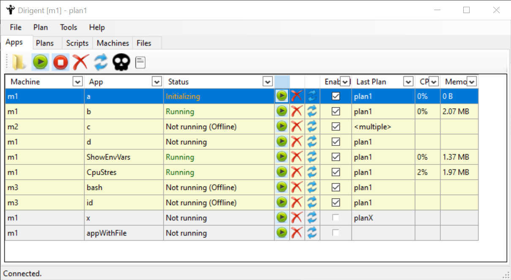

# Dirigent Overview

Dirigent is a multi-platform remote app control & multi-machine system management tool. It allows

* Launching a given set of apps in given order on multiple different machines according to a user-defined launch plans
* Monitoring if the apps are running, optionally restarting them automatically.
* Remotely starting individual apps/plan, querying the app/plan status.
* Easy access to predefined files from different apps or different machines (like apps logs)
* Downloading a package of files from multiple different machines at once (like system config files etc.)
* Quickly running tools targeted to selected machine (like a VNC)

* Automation of the above tasks via user scripts written in C#, running on different machines (RPC)
* Controlling via a simple GUI apps running in a system tray
* Remote control via a CLI utility or via a TCP connection.

It depends on .net 6.0, running on Windows (fully featured) and Linux (limited features).

# Contents

### Concepts

[Apps](docs/Apps.md)

[Plans](docs/Plans.md)

[Commands](docs/CLI.md)

[Scripts](docs/Scripts.md)

[Tools](docs/Tools.md)

[Actions](docs/Actions.md)

[Environment Variables](docs/EnvVars.md)

#### Configuration

[Agent process](docs/Agent.md)

[Shared Config](docs/SharedConfig.md)

[Local Config](docs/LocalConfig.md)

#### Remote Control

[Remote control using CLI](docs/CLI.md)

[Web API](docs/HTTP.md)

#### Design

[Architecture](docs/Architecture.md)

[Design notes (not up to date)](docs/Design-notes.md)

# Building from source

Requires: net 6, powershell, Visual Studio 2022

#### Building a release

1. Run the `new_release.bat`
2. Find the built binaries in the release folder

#### Development & debugging in Visual Studio

1. Open `src/Dirigent.NetCore.sln` in Visual Studio and rebuild.
2. Make the `Dirigent.Agent.WinForms` the startup project
3. Run with command line `--isMaster 1 --machineId m1 --debug 1`
   1. Alternatively you can run different variants of `run_*.bat scripts`

# Quick Start Guide

#### Configure launch plans

Define launch plans, i.e. what apps to start on what computer in what order. Store it into a `SharedConfig.xml` config file next to the `Dirigent.Agent.exe` on a computer chosen to be the Dirigent Master.

For example the following plan "plan1" contains two applications. One named "a" should be run  on machine 'm1', the other is named "b" and should be run on machine m2.

Both apps are based on the same template `apps.notepad` defining the basic attributes that are then overridden with settings from the <App /> element.

    <?xml version="1.0" encoding="UTF-8"?>
    <Shared>
        <Plan Name="plan1" StartTimeout="10">
            <App
                AppIdTuple = "m1.a"
                Template = "apps.notepad"
                StartupDir = "c:\"
                CmdLineArgs = "aaa.txt"
                >
                <WindowPos TitleRegExp="\s-\sNotepad" Rect="10,50,300,200" Screen="1" Keep="0" />
            </App>
    
            <App
                AppIdTuple = "m2.b"
                Template = "apps.notepad"
                StartupDir = "c:\"
                CmdLineArgs = "bbb.txt"
                Dependencies = "m1.a"
            />
        </Plan>
    
        <AppTemplate Name="apps.notepad"
                Template = ""
                ExeFullPath = "c:\windows\notepad.exe"
                StartupDir = "c:\"
                CmdLineArgs = ""
                StartupOrder = "0"
                RestartOnCrash = "1"
                SeparationInterval = "3.5"
        >
            <InitDetectors>
              <WindowPoppedUp TitleRegExp="\s-\sNotepad"/>
              <TimeOut>5.0</TimeOut>
            </InitDetectors>
        </AppTemplate
    </Shared>

What that plan will do if launched?

1. Opens a notepad app (called 'a') on machine `m1` with file `c:\aaa.txt`. 
2. Waits for the notepad to open. The window will be positioned to specified screen coordinates.
3. Waits 3.5 seconds
4. Opens another notepad (called 'b') on machine `m2` with file `c:\bbb.txt`.
5. If the 'a' notepad doesn't start in 5 seconds, the plan indicates a failure. Moreover, because 'b' is defined to be dependent on 'a', the 'b' notepad won't be launched.

#### Deploy agents

On each machine install the Dirigent binaries (Windows Desktop .net runtime required).

Assign a unique machineId to each agent so it could identify its application in the launch plan. The machineIds need to match those used in the SharedConfig.xml.

On first machine start the agent in master mode (there must be exactly one master):

    Dirigent.Agent.exe --machineId m1 --isMaster 1

On second machine start the agent in slave mode; specify the IP address of the master machine

    Dirigent.Agent.exe --machineId m2 --masterIp 10.1.1.2

#### Tell Dirigent what to do

Issue a Start Plan command, either from Dirigent's UI, or via a CLI.

For example using a command ling control app:

    Dirigent.CLI.exe --masterIp 10.1.1.2 StartPlan plan1

Multiple commands can be executed at once if separated by a semicolon. For example  

    Dirigent.CLI.exe --masterIp 10.1.1.2 StartApp m1.a; StartApp m2.b

