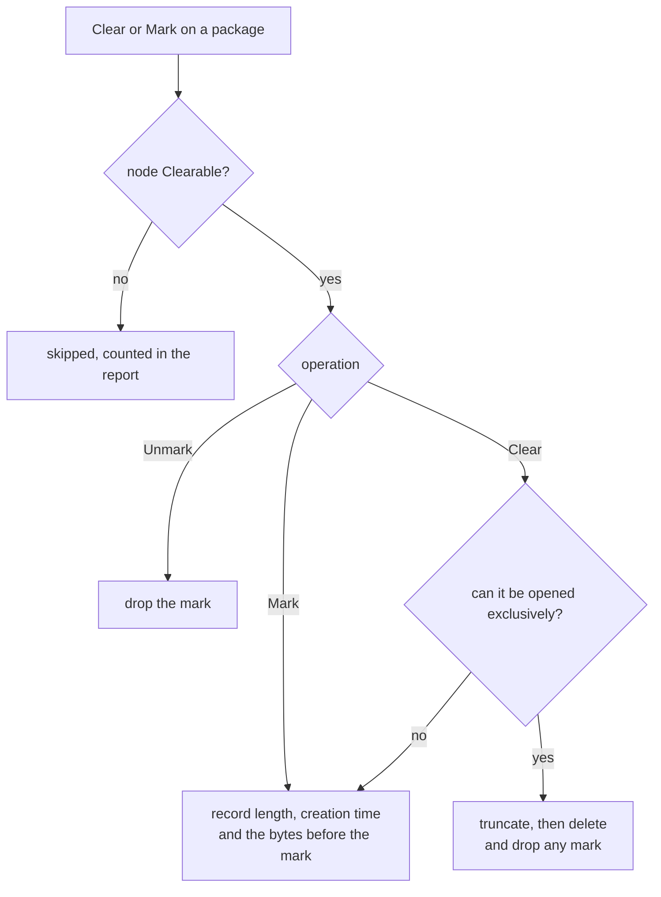

# Marking and clearing: collecting one run's worth of files

Why the "reset the logs before a test run" feature is a high-water mark rather than a delete, and
what had to be true for it to work. Implemented; the attribute and action reference lives in
[Files.md](Files.md#collecting-one-test-run-clear-mark-and-unmark), and the recipe in
[Collecting One Test Run](LogFileCollection.md#collecting-one-test-run-not-the-whole-afternoon).

Contents:

* [The need](#the-need)
* [Why marking, not deleting](#why-marking-not-deleting)
* [`Clearable`: nothing is touched unless it says so](#clearable-nothing-is-touched-unless-it-says-so)
* [The three operations](#the-three-operations)
* [What the collection does with a mark](#what-the-collection-does-with-a-mark)
* [Where the marks live](#where-the-marks-live)
* [Recognising the file a mark was made on](#recognising-the-file-a-mark-was-made-on)
* [The user interface](#the-user-interface)
* [Marking from a plan](#marking-from-a-plan)
* [What this refuses to do](#what-this-refuses-to-do)
* [Decisions, and what they replaced](#decisions-and-what-they-replaced)
* [Found while building it](#found-while-building-it)
* [What the tests cover](#what-the-tests-cover)

## The need

Somebody who can reproduce a problem wants two clicks around the run: one before it, one after, and
an archive holding only what that run produced. Before this, the collection took whatever was in the
log files, which on a long-running system is mostly somebody else's afternoon.

The two clicks are **Clear** (or **Mark**) before, and **Download** after.

## Why marking, not deleting

"Reset the logs" sounds like deleting or emptying them. Measured against a logger that holds its
file open - which is the normal state of a running system - both are worse than useless:

| the logger permits | delete | truncate to zero | read the length |
| --- | --- | --- | --- |
| `Read` (the usual case) | **fails** | **fails** | works |
| `ReadWrite` | **fails** | succeeds - see below | works |
| `ReadWrite \| Delete` | succeeds - see below | succeeds - see below | works |

Where truncation succeeds the logger keeps writing at its old offset, so the file comes back as a
run of NUL bytes followed by the new line. Where deletion succeeds the file is unlinked while the
logger keeps writing into it, so everything the application logs afterwards goes somewhere nobody
can find. Reading the length always works and changes nothing.

So the mechanism is a **high-water mark**: the reset records how long each file is, and the
collection takes only what came after. It works on a locked file, cannot corrupt anything, and -
the part that matters on a production site - destroys no history. Dirigent already had the reading
half: `FileTail` seeks to an offset and moves forward to a line boundary.

## `Clearable`: nothing is touched unless it says so

A package worth collecting is rarely only logs. The JFTES packages hold the applications' logs
*and* their configuration files, and a single archive containing both is the point.

Deleting a configuration file must be impossible - not "unlikely", not "only if the action names
it". So the permission lives on the node, and it is off by default:

```xml
<File   Id="log" Title="Log/IgManager" Path="C:\Bagira\JFTES\IG\Logs\IgManager"
        Filter="Newest" MaxFiles="10" Clearable="1"/>

<File   Id="cfg.dds" Title="Config/cyclonedds.xml" Path="%APP_STARTUPDIR%\cyclonedds.xml"/>
```

`Clearable="0"` (the default) means the file is never cleared and never marked, whatever any
action, package or argument says. `cfg.dds` above cannot be destroyed by any click.

**It gates marking as well as clearing, and that is deliberate.** Marking looks harmless, but
marking a configuration file would mean the next collection takes only the bytes appended since -
usually none - so the file would silently arrive empty. A flag that permitted marking but not
clearing would trade a loud failure for a quiet one.

So read `Clearable` as the whole permission, of which marking is the gentler half: a file that may
be emptied may also have a line drawn under it, and a file that may not is always collected whole.

| kind of file | `Clearable` | why |
| --- | --- | --- |
| application log, append-only | `1` | the run boundary is the whole point |
| crash dump folder | `1` | old dumps muddy a run; nothing holds a dump open |
| configuration file | `0` (default) | it is the run's input, not its output |
| a file somebody may need whole | `0` | the default protects it |

The cost is honest: every log node needs the attribute, and the JFTES config declares about thirty
of them. Declaring it in an `<AppTemplate>` covers every app using the template at once.

## The three operations

Three built-in scripts over one implementation (`MarkOrClearFiles`), so that each menu item reads
as what it does:

| script | menu | what it does to each **clearable** file in scope |
| --- | --- | --- |
| `BuiltIns/ClearFiles.cs` | **Clear** | empties it if that is safe, marks it otherwise |
| `BuiltIns/MarkFiles.cs` | **Mark** | records the mark only, touches no file |
| `BuiltIns/UnmarkFiles.cs` | **Unmark** | drops the mark, so the next collection takes everything |

**Clear** decides per file, and the decision is a measurement rather than a guess: it tries to open
the file **exclusively** (`FileShare.None`), which succeeds only when no other process has it open.

* The open **succeeds** - nobody is holding the file - so it is truncated inside that window and
  then deleted, and any mark on it is dropped. The application recreates the file on its next
  write; a new file has no mark, so the collection takes it whole, which is exactly "since the
  clear".
* The open **fails** - something is writing - so it marks the file instead and says so.

That is the one click for a QA session: closed logs and crash dumps really are cleared, live logs
are marked, and nothing is corrupted either way. **Mark** is the same operation with the
destructive half removed, which is what a production site wants: the run is delimited and the
history survives.

Each operation reports per machine what happened - cleared, marked, skipped as not clearable, not
there, failed. The skipped count is what makes a forgotten `Clearable="1"` discoverable: without
it, a log would quietly keep its old contents and the collection would look wrong for no visible
reason.

Each runs one slave (`BuiltIns/MarkFilesSlave.cs`) per machine, because the marks are kept per
machine and a file can only be opened by the machine that owns it. Progress is counted per machine
as each finishes; these operations read lengths and delete files, so there would be no point in
weighing them by bytes.

## What the collection does with a mark

`DownloadZippedSlave` already streamed each file into the archive from an offset. It gained one
question: does this file have a mark?

| what it finds | what it collects |
| --- | --- |
| no mark | the whole file - it is all new |
| a mark, and the file is still the one that was marked | from the mark, cut at the next line boundary |
| a mark, but the file was replaced | the whole file, noting that it was replaced since the mark |
| a mark, but the file is shorter than the mark | the whole file, noting that it was truncated or rotated |

Rotation therefore yields slightly **more** than the window, never less: the fresh `app.log` is a
different file so it arrives whole, and `app.log.1` was never marked so it arrives whole too.
Failing towards too much is the right direction, and the archive says why.

Marks and `TailBytes` compose: the file starts at whichever cut is later, and the entry is named and
headed after whichever of the two was binding. Each is a ceiling on what can be delivered - a mark
inside the tail leaves the tail's start standing, because the bytes before it cannot be transferred
at all.

A partial entry is named for what it is - `app.since-mark.log` - and its first line states the
offset and the mark's time. `_comment.txt` gains a `Since` line naming the beginning of the window,
which is the difference between "these are the logs" and "these are the logs of one run".

Collecting does **not** clear the mark. Two collections after one mark give the same window, which
is what somebody re-downloading after a failed transfer expects.

## Where the marks live

On each machine, in a small JSON file beside the agent status file - `--agentStatusFolder` already
existed as a seam, so marks survive an agent restart and a test can isolate them. They have to live
on the machine because that is where the files are and where the collecting slave runs.

Keyed by **path**, not by node or package, so that "mark, then collect" holds however the collection
is assembled. Two people marking overlapping packages means the later mark wins; harmless, and every
entry header states the mark's time, so it is never a mystery which run a file was cut for.

The store reaches the scripts through the `ScriptFactory` the agent constructs, which puts it on
`Script.MarkStore`. Not a process-wide static: a tier-1 test bed runs a master and several agents in
one process, and they must not share each other's marks. A host that keeps no store - the master, a
GUI - leaves it null, which the scripts read as "nothing has been marked", the safe reading.

## Recognising the file a mark was made on

An offset is worth nothing unless the file behind it is still the same file, and on Windows the
obvious check does not hold. **NTFS tunneling** restores the original creation time on a file
deleted and recreated under the same name within about fifteen seconds - which is exactly what a
rotating logger does. A rotated file therefore arrives wearing the marked file's creation time, and
starting at the mark would deliver a slice of the middle of an unrelated file as if it were the test
run.

So a mark also keeps the **last 32 bytes before the offset**, and the collection compares them
before trusting the offset. That checks the one thing that has to be true: that the boundary is
still where it was put. Creation time and length are kept too - they are free, and they catch the
cases the bytes cannot (a file shorter than its mark has nothing to compare).

## The user interface

Nothing new was needed for the menus; the actions ride the paths the download already used.

* **A node's context menu** - the actions declared on the package, so Clear / Mark / Unmark appear
  beside Download.
* **The main menu** - a `<FileRef Id="pkg.run"/>` under `<MainMenu>` is rendered by the same
  builder, so the package becomes a submenu and its actions the items:
  `File -> Logs -> Test run -> Clear / Mark / Unmark / Download`.
* **The Files tab** - each row's menu is built from that node's actions, which is how Download
  appears there. Adding the three scripts to `DefaultFileActions` and `DefaultFilePackageActions`
  in `LocalConfig.xml` puts them on every row, with no code.
* **Progress and completion** - each operation appears in the status bar of the GUI that started
  it, with a working cancel, and ends in a message box naming what it did, so the operator knows
  the phase is over before starting the next one.



## Marking from a plan

The two clicks are for somebody sitting at the GUI. A `System Start` plan can draw the line by
itself, so that every start of the system is a run boundary and nobody has to remember:

```xml
<App AppIdTuple = "master.mark_logs"
     ExeFullPath = "[dirigent.command]"
     CmdLineArgs = "StartScript 7B3C1E90-1111-2222-3333-444455556666 BuiltIns/MarkFiles.cs ""'{Node:{Id:''pkg.run''}}'"" ; WaitForScript 7B3C1E90-1111-2222-3333-444455556666 timeout=300"
     Volatile = "1"
     InitCondition = "cliresponse any"
/>
```

Every application of the plan then names this step in its `Dependencies`, so nothing starts writing
before the line is drawn. `cliresponse any` is the right value here: a mark that could not be taken
degrades a later collection, and must not stop the system from starting - the failure goes to the log
and to the plan's own record of the step.

`ClearFiles` works the same way, and is the destructive half: use it where a QA machine should start
each run with the logs really emptied.

See [Running a script as a step of a plan](ScriptsInPlans.md) for how the waiting works, and
[`WaitForScript`](CLI.md#waitforscript) for the command that does it.

## What this refuses to do

* **Clear a file that is not `Clearable`.** No action, argument or package can override it.
* **Stop an application to free its log.** Dirigent could, and a menu item that stops the system
  under test is not something anybody wants. A held file is marked instead.
* **Guess.** Clear does not decide by file name, extension or folder whether emptying is safe: it
  opens the file exclusively or it does not.

## Decisions, and what they replaced

* **One flag, not two.** An earlier draft gated only clearing. Marking a configuration file makes
  the next collection deliver it empty, which is quieter and therefore worse than deleting it.
* **Called `Clearable`, though it governs marking too.** `Resettable` described the widened meaning
  more literally, but `Clearable` reads better beside `ClearFiles` and is the name the operation is
  known by. The wider meaning is documented at the flag instead of encoded in its name.
* **`Clearable` on the node, not a list on the action.** The first proposal had the Clear action
  naming which node ids to reset, which is one line instead of thirty attributes - but it made
  safety a property of every action that would ever be written, rather than of the file. A config
  survives a badly written action; it does not survive a badly written action plus a click.
* **No separate operation for dumps.** A dump folder marked `Clearable="1"` is cleared by Clear,
  because nothing holds a dump open. That is what a separate "delete the dumps" would have done.
* **Nesting is not needed here.** A package can reference another package - verified - but that
  would put the reset item and the download item in different menus, which is the two-operation
  feel this design exists to avoid. Nesting stays useful for composing collections.
* **Unmark ignores `Clearable`,** unlike the other two. It only ever removes a mark, which can only
  make a later collection more complete; refusing it on a node whose `Clearable` was taken away
  after it had been marked would leave that mark in place with no way of getting rid of it.

## Found while building it

* **NTFS tunneling**, above: the creation time cannot tell a rotated file from the one that was
  marked. A tier-0 test recreates a file of exactly the same length so that nothing but the bytes
  can catch it.
* **Truncate before deleting, not instead of it.** Once the exclusive handle is held the truncation
  cannot fail, while the deletion still can - a read-only attribute, a folder's permissions - and a
  file that has been emptied is cleared either way. Deleting on top of that only keeps the folder
  tidy.
* **The `Args` patterns have to match the title as well as the id.** A `<FileRef Id="log"
  MachineId="*" AppId="*"/>` matching several nodes resolves to a folder carrying the reference's id
  as its **title** and no id of its own, so `Args="log"` found nothing at all until both were
  matched.
* **Two downloads of one package in the same minute collided.** The archive name carries the time to
  the minute, and the second download failed at the very end, after everything had been collected.
  Downloading again after a transfer went wrong is precisely when that happens, so the name now
  steps aside to `_2`. Found by the test that checks a mark survives a second collection.
* **A count for "not there".** A log that has not been written yet is neither a success nor a
  failure to report as one, and it is the normal state of a fresh installation.
* **The Files tab really did build its own `MenuBuilder`**, as the design suspected, so a download
  started from there showed no progress and offered no cancel. The tabs now share the window's
  builder, which is the one wired to the status bar.

## What the tests cover

At tier 0 (`FileMarkStoreTests`, 13 tests): the store's round trip, per-machine isolation,
case-insensitive paths, the staleness rules including the same-length tunneled replacement, a
damaged store meaning "no marks", and the cut landing on a line boundary.

At tier 1 (`MarkAndClearTests`, 10 tests): mark, append, collect, and the archive holding only the
new lines while the non-clearable config arrives whole in the same archive; the entry header; a
locked file marked rather than cleared while a free one is really deleted; a non-clearable node
skipped and counted; `Unmark` restoring the full history; `Args` narrowing the set; a file replaced
between mark and collect arriving whole with the note; the `Since` line in `_comment.txt`; marking
twice moving the line forward; and a second download of the same run yielding the same window.

The status bar, the menus and the message boxes need eyes, as before.
