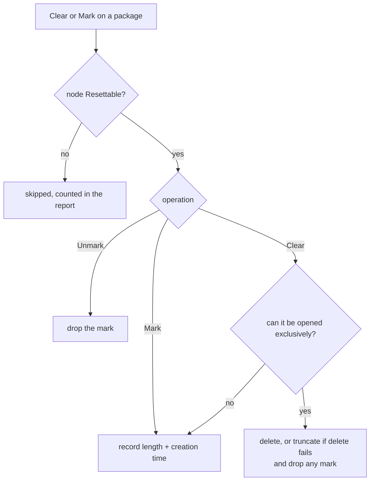

# Marking and clearing: collecting one run's worth of files

A design, for review. Nothing of this is implemented yet.

## The need

Somebody who can reproduce a problem wants two clicks around it: one before the run, one after, and
an archive holding only what that run produced. Today the collection takes whatever is in the log
files, which on a long-running system is mostly somebody else's afternoon.

The two clicks are **Clear** (or **Mark**) before, and **Download** after.

Contents:

* [Why marking, not deleting](#why-marking-not-deleting)
* [`Resettable`: nothing is touched unless it says so](#resettable-nothing-is-touched-unless-it-says-so)
* [The three operations](#the-three-operations)
* [What the collection does with a mark](#what-the-collection-does-with-a-mark)
* [Where the marks live](#where-the-marks-live)
* [Configuration](#configuration)
* [The user interface](#the-user-interface)
* [What this will refuse to do](#what-this-will-refuse-to-do)
* [Decisions, and what they replaced](#decisions-and-what-they-replaced)
* [What tests will cover](#what-tests-will-cover)

## Why marking, not deleting

"Reset the logs" sounds like deleting or emptying them. Measured against a logger that holds its
file open - which is the normal state of a running system - both are worse than useless:

| the logger permits | delete | truncate to zero | read the length |
| --- | --- | --- | --- |
| `Read` (the usual case) | **fails** | **fails** | works |
| `ReadWrite` | **fails** | succeeds - see below | works |
| `ReadWrite \| Delete` | succeeds - see below | succeeds - see below | works |

Where truncation succeeds the logger keeps writing at its old offset, so the file comes back as a
run of NUL bytes followed by the new line. Where deletion succeeds the file is unlinked while the
logger keeps writing into it, so everything the application logs afterwards goes somewhere nobody
can find. Reading the length always works and changes nothing.

So the mechanism is a **high-water mark**: the reset records how long each file is, and the
collection takes only what came after. It works on a locked file, cannot corrupt anything, and -
the part that matters on a production site - destroys no history. Dirigent already has the reading
half: `FileTail.SeekToTailStart` seeks to an offset and moves forward to a line boundary.

## `Resettable`: nothing is touched unless it says so

A package worth collecting is rarely only logs. The JFTES packages hold the applications' logs
*and* their configuration files, and a single archive containing both is the point.

Deleting a configuration file must be impossible - not "unlikely", not "only if the action names
it". So the permission lives on the node, and it is off by default:

```xml
<File   Id="log" Title="Log/IgManager" Path="C:\Bagira\JFTES\IG\Logs\IgManager"
        Filter="Newest" MaxFiles="10" Resettable="1"/>

<File   Id="cfg.dds" Title="Config/cyclonedds.xml" Path="%APP_STARTUPDIR%\cyclonedds.xml"/>
```

`Resettable="0"` (the default) means the file is never cleared and never marked, whatever any
action, package or argument says. `cfg.dds` above cannot be destroyed by any click.

**It gates marking as well as clearing, and that is deliberate.** Marking looks harmless, but
marking a configuration file would mean the next collection takes only the bytes appended since -
usually none - so the file would silently arrive empty. A flag that permitted marking but not
clearing would trade a loud failure for a quiet one.

Hence the name: `Resettable`, not `Clearable`. It answers "may this file's history be treated as
disposable, whether by emptying it or by drawing a line under it". Where it fits naturally:

| kind of file | `Resettable` | why |
| --- | --- | --- |
| application log, append-only | `1` | the run boundary is the whole point |
| crash dump folder | `1` | old dumps muddy a run; marking one means "already seen" |
| configuration file | `0` (default) | it is the run's input, not its output |
| a file somebody may need whole | `0` | the default protects it |

The cost is honest: every log node needs the attribute, and the JFTES config declares about thirty
of them. Declaring it in an `<AppTemplate>` covers every app using the template at once.

## The three operations

Three built-in scripts over one implementation, so that each menu item reads as what it does:

| script | menu | what it does to each **resettable** file in scope |
| --- | --- | --- |
| `BuiltIns/ClearFiles.cs` | **Clear** | empties it if that is safe, marks it otherwise |
| `BuiltIns/MarkFiles.cs` | **Mark** | records the mark only, touches no file |
| `BuiltIns/UnmarkFiles.cs` | **Unmark** | drops the mark, so the next collection takes everything |

**Clear** decides per file, and the decision is a measurement rather than a guess: it tries to open
the file **exclusively** (`FileShare.None`).

* The open **succeeds** - nobody is holding the file - so it deletes it inside that window, falling
  back to truncating if the delete fails, and drops any mark it had. The application recreates the
  file on its next write; a new file has no mark, so the collection takes it whole, which is exactly
  "since the clear".
* The open **fails** - something is writing - so it marks the file instead and says so.

That is the one click for a QA session: closed logs and crash dumps really are cleared, live logs
are marked, and nothing is corrupted either way. **Mark** is the same operation with the
destructive half removed, which is what a production site wants: the run is delimited and the
history survives.

Each operation reports per machine what happened - cleared, marked, skipped as not resettable,
failed. The skipped count is what makes a forgotten `Resettable="1"` discoverable: without it, a
log would quietly keep its old contents and the collection would look wrong for no visible reason.

## What the collection does with a mark

`DownloadZippedSlave` already streams each file into the archive from an offset. It gains one
question: does this file have a mark?

| what it finds | what it collects |
| --- | --- |
| no mark | the whole file - it is all new |
| a mark, and the file's creation time still matches, and it has not shrunk | from the mark, cut at the next line boundary |
| a mark, but the creation time changed | the whole file, noting that it was replaced since the mark |
| a mark, but the file is shorter than the mark | the whole file, noting that it was truncated or rotated |

Rotation therefore yields slightly **more** than the window, never less: the fresh `app.log` has a
new creation time so it arrives whole, and `app.log.1` was never marked so it arrives whole too.
Failing towards too much is the right direction, and the header says why.

Marks and `TailBytes` compose: the file starts at whichever is later, the mark or the tail.

A partial entry is named for what it is - `app.since-mark.log` - and its first line states the
offset, the mark's time and whether the mark was stale, exactly as a `TailBytes` entry does.
`_comment.txt` gains a line: *"Logs collected since the mark of 2026-08-31 15:02:11"*.

Collecting does **not** clear the mark. Two collections after one mark give the same window, which
is what somebody re-downloading after a failed transfer expects.

## Where the marks live

On each machine, in a small JSON file beside the agent status file - `--agentStatusFolder` already
exists as a seam, so marks survive an agent restart and a test can isolate them. They have to live
on the machine because that is where the files are and where the collecting slave runs.

Keyed by **path**, not by node or package, so that "mark, then collect" holds however the collection
is assembled. Two people marking overlapping packages means the later mark wins; harmless, and every
entry header states the mark's time, so it is never a mystery which run a file was cut for.

## Configuration

One package, one archive, four menu items, nothing declared twice:

```xml
<FilePackage Id="pkg.run" Title="Logs/Test run"
             Description="One test run: clear, run the case, download.">
    <FileRef Id="log"  MachineId="*" AppId="*"/>
    <FileRef Id="log2" MachineId="*" AppId="*"/>
    <FileRef Id="cfg"  MachineId="*" AppId="*"/>

    <Script Title="Clear"    Name="BuiltIns/ClearFiles.cs"/>
    <Script Title="Mark"     Name="BuiltIns/MarkFiles.cs"/>
    <Script Title="Unmark"   Name="BuiltIns/UnmarkFiles.cs"/>
    <Script Title="Download" Name="BuiltIns/DownloadZipped.cs" AskComment="1"/>
</FilePackage>
```

The `cfg` nodes need no exclusion: they are not `Resettable`, so Clear and Mark pass over them and
the archive gets them whole.

**Narrowing, when wanted:** the scripts read `Args` as a semicolon-separated list of node id
patterns - the same wildcard matching `<FileRef>` uses - and act only on the matching children of
the package. `Args="log*"` clears the logs and leaves other resettable nodes alone. Empty `Args`
means every resettable node in scope.

`Args` and not a new attribute, because a list of node ids is the script's own argument, and `Args`
is where a script's arguments belong. `AskComment` is the other way round - a directive the GUI
reads before the script exists - which is why that one is an attribute. The distinction is who
consumes the value.

## The user interface

Nothing new is needed for the menus; the actions ride the paths the download already uses.

* **A node's context menu** - the actions declared on the package, so Clear / Mark / Unmark appear
  beside Download.
* **The main menu** - a `<FileRef Id="pkg.run"/>` under `<MainMenu>` is rendered by the same
  builder, so the package becomes a submenu and its actions the items:
  `File → Logs → Test run → Clear / Mark / Unmark / Download`.
* **The Files tab** - each row's menu is already built from that node's actions, which is how
  Download appears there. Adding the three scripts to `DefaultFileActions` and
  `DefaultFilePackageActions` in `LocalConfig.xml` puts them on every row, with no code.
* **Progress and completion** - each operation appears in the status bar of the GUI that started
  it, with a working cancel, and ends in a message box naming what it did, so the operator knows the
  phase is over before starting the next one. Progress is counted per machine as each finishes;
  these operations read lengths and delete files, so there is no point weighting them by bytes.



**One bug to fix on the way.** `MainExtension` builds its own `MenuBuilder`, separate from the
form's, and only the form's has the subscriber that puts an operation in the status bar. So a
download started from the **Files tab** shows no progress and offers no cancel today. The tabs
should use the form's builder, so one subscription covers every path.

## What this will refuse to do

* **Clear a file that is not `Resettable`.** No action, argument or package can override it.
* **Stop an application to free its log.** Dirigent could, and a menu item that stops the system
  under test is not something anybody wants. A held file is marked instead.
* **Guess.** Clear does not decide by file name, extension or folder whether emptying is safe: it
  opens the file exclusively or it does not.

## Decisions, and what they replaced

* **One flag, not two.** An earlier draft gated only clearing. Marking a configuration file makes
  the next collection deliver it empty, which is quieter and therefore worse than deleting it.
* **`Resettable` on the node, not a list on the action.** The first proposal had the Clear action
  naming which node ids to reset, which is one line instead of thirty attributes - but it made
  safety a property of every action that would ever be written, rather than of the file. A config
  survives a badly written action; it does not survive a badly written action plus a click.
* **No separate operation for dumps.** A dump folder marked `Resettable="1"` is cleared by Clear,
  because nothing holds a dump open. That is what a separate "delete the dumps" would have done.
* **Nesting is not needed here.** A package can reference another package - verified - but that
  would put the reset item and the download item in different menus, which is the two-operation feel
  this design exists to avoid. Nesting stays useful for composing collections.

## What tests will cover

At tier 1, without a GUI: mark, append, collect, and assert the archive holds only the new lines
while the non-resettable config arrives whole in the same archive; a file replaced between mark and
collect arrives whole with the note; a locked file is marked rather than cleared; a file nobody
holds is really cleared; a non-resettable node is skipped and counted; `Unmark` restores the full
history; `Args` narrows the set. At tier 0: the mark store's round trip, and the staleness rules.

The status bar, the menus and the message boxes need eyes, as before.
