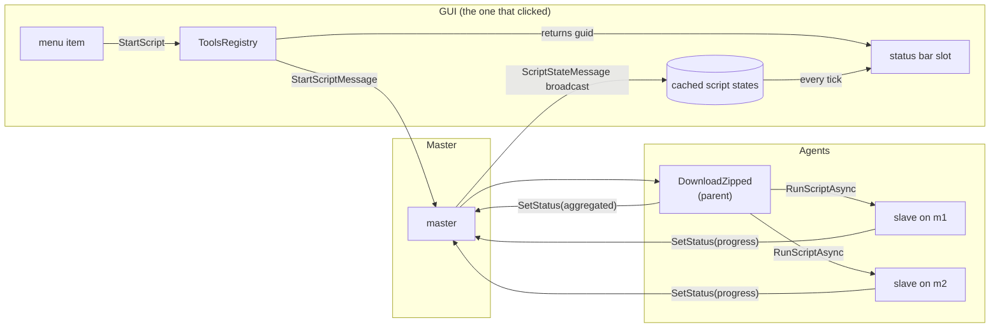

# Progress and cancellation for long operations

Implemented as described below. What differed from the design as written is noted at the end,
under [What the building changed](#what-the-building-changed).

## The problem

Collecting logs from several machines takes from seconds to many minutes, and while it runs
Dirigent shows nothing. `BuiltIns/DownloadZipped.cs` sends a one-second balloon at the start
(*"Downloading from 3 machine(s)..."*) and a message box at the end. In between there is no
indication that anything is happening, no idea how far along it is, and no way to stop it.

That matters most exactly where it hurts: a folder holding an unrotated multi-gigabyte log takes
minutes to compress, which is indistinguishable from a hang.

## Scope

Agreed before writing this:

* Only operations **started from the GUI** show progress.
* Progress appears **only in the GUI that started it**, not in others.
* No tray-icon tooltip.
* Cancelling **removes the partial archive**.

Everything else - scripts started from the CLI, the REST surface, or by another script - keeps
behaving as it does today. They are not silent, they simply report to whoever asked for them.

## What already exists

| Piece | Where | Note |
| --- | --- | --- |
| `SetStatus( text, data )` | `Script` | any script can publish a status at any time |
| `ScriptState { Status, Text, Data }` | `ScriptState.cs` | no number in it, `Data` is script-specific JSON |
| `ScriptStateMessage` | `Messages.cs` | **broadcast to every subscribed client**, keyed by instance guid |
| cached states per client | `ReflectedScriptRegistry` | `GetScriptState(guid)` on the GUI side |
| the instance guid, at start | `RunScriptNoWait` returns it | the starter knows what it started |
| `GetScriptStateAsync(guid)` | `IDirigAsync` | a script can poll another script |
| `KillScriptMessage` | master -> agent -> `ScriptRunner` | cancels the runner's `CancellationTokenSource` |
| `EScriptStatus.Cancelling` | `ScriptState.cs` | a state to display between the click and the stop |

So the transport, the caching and the kill path are all in place. What is missing is a number, an
aggregation rule, three cancellation checks, and the widget.

## Which script the GUI shows

**The GUI shows the scripts it started itself.** No new flag.

`RunScriptNoWait` already returns the instance guid; the GUI keeps those guids in a set and drops
each one when its state stops being alive. The nesting question answers itself: the download's
slave scripts are started by `DownloadZipped`, not by the GUI, so a GUI never has their guids and
never shows them.

A *"top level"* flag on the script would say *this is worth watching* but not *by whom*, so with
two GUIs open both would show a bar for a download only one of them asked for. If tracking ever
needs to survive a GUI restart, the fix is not a flag either: it is to carry `Requestor` (which
`StartScriptMessage` already has) into `ScriptState`, and let each client show the alive scripts
whose requestor is itself. Not needed for the agreed scope.

One small change is required: `ToolsRegistry.StartScript` currently discards the guid that
`RunScriptNoWait` returns. `StartAction` / `StartScript` / `StartFileBoundAction` /
`StartFilePackageBoundAction` need to return it so `MenuBuilder` can hand it to the status bar.



## The progress number

Add to `ScriptState`:

```csharp
/// <summary>
/// How far the operation has got, 0..1. Null means "running, no idea how far" - the GUI then
/// shows an indeterminate bar rather than a wrong number.
/// </summary>
public double? Progress;
```

and an optional parameter on the script API:

```csharp
protected Task SetStatus( string? text = null, string? data = null, double? progress = null )
```

`ScriptRunner` already builds `ScriptState` from `IScript.StatusText` / `StatusData`; it gains one
more line for `StatusProgress`. Wire-safe in both directions: MessagePack is configured
contractless here, so members travel by name and a peer that does not know the field ignores it.

Deliberately **not** carried inside `Data`: that is script-specific JSON, and the status bar must
not have to understand any particular script to draw a bar.

## Aggregation

In the script, not in the framework. `DownloadZipped` already holds every slave's guid in
`SlaveTask.scriptId` and `GetScriptStateAsync(guid)` exists, so the parent polls its children and
publishes one number. No parent/child links in the protocol, no tree walking in the GUI. The
script is the only thing that knows what "half done" means for its own work.

Proposed split for a download:

| Phase | Share of the bar | Text shown |
| --- | --- | --- |
| resolving the node, finding machines | 0.00 - 0.05 | `Resolving...` |
| slaves compressing | 0.05 - 0.85 | `Collecting from m1, m2 (2 of 3 done)` |
| merging the parts | 0.85 - 1.00 | `Merging...` |

Within the slave phase the parent averages the slaves' own progress, weighted by the bytes each
one announced - a machine holding 60 GB should not count the same as one holding 2 MB. A slave
that has not reported yet counts as 0.

What each script reports:

* **`DownloadZippedSlave`** - the total bytes to collect are known before compressing (the resolved
  tree carries the sizes, and `FileTail` says how much of an oversized file will be taken), so it
  reports `bytesDone / bytesTotal` and a text naming the current file. Updated every ~4 MB, not
  per file: one 60 GB file must not sit at one number for minutes.
* **`MergeZipped`** - entries copied / total entries.
* **`DownloadZipped`** - the aggregate above, polling the slaves about twice a second.

## Cancellation

The kill path exists end to end, but **none of the three download scripts observes its
`CancellationToken`** - and `ScriptRunner` explicitly "just lets it go" when a script ignores the
token. So a cancel button today would remove the bar while the machines carried on working, and a
zip would appear minutes later. Three things must change before the button is honest:

1. **`DownloadZippedSlave`** - the copy loop becomes a chunked copy that checks the token (or
   `CopyToAsync(dst, ct)`), so a cancel takes effect inside a huge file rather than after it. The
   `.part` file is removed by the existing failure path, which is also what satisfies *"partial
   gone"*: the archive under construction never had its final name.
2. **`DownloadZipped`** - on cancellation, `KillScript` every slave guid and the merge if it is
   running, then delete the staging folder. Killing only the parent leaves the slaves compressing.
3. **`MergeZipped`** - the same token check in its entry loop, and the half-written destination
   file deleted. It is the one that writes under the final name.

Then a cancelled download leaves: no archive, no `.part`, no staging folder. The script ends as
`Cancelled`, and the closing message box is skipped - the user knows, they asked for it.

## The user interface

### Where it goes

`Main.Designer.cs` currently has a `statusStrip` holding a single `toolStripStatusLabel1`, which
`refreshStatusBar()` sets to `Connected.` / `Disconnected.` on every tick.

A `StatusStrip` is a single row, so several operations cannot be stacked without a second strip.
They go **side by side**, each as a slot of three items:

```
+--------------------------------------------------------------------------------+
| Connected.   Collecting logs  [######----]  X   Incident report [##--------] X  |
+--------------------------------------------------------------------------------+
```

| Item | Type | Size |
| --- | --- | --- |
| title | `ToolStripStatusLabel` | auto, `AutoToolTip` carrying the full status text |
| bar | `ToolStripProgressBar` | 100 px, `Continuous`, or `Marquee` while `Progress` is null |
| cancel | `ToolStripButton` | 20 px, `DisplayStyle = Image`, a red cross, `ToolTipText = "Cancel"` |

At roughly 250 px per slot, two fit next to the connection label on the default 889 px window.
**Two slots are shown**; beyond that a single `+N more` label appears, its tooltip listing the
titles. Concurrency above two is rare enough not to design further around.

### Lifecycle

The items are created and removed at run time, not in the designer, since the count varies. A
small private class holds them together:

```csharp
class OperationSlot
{
    public Guid Instance;
    public ToolStripStatusLabel Title;
    public ToolStripProgressBar Bar;
    public ToolStripButton Cancel;
    public bool Cancelling;
}
```

`Main` keeps `Dictionary<Guid, OperationSlot> _operations`, filled when a menu action returns a
guid. On every tick, inside the existing `refreshStatusBar()`:

* read `_core.ReflStates.GetScriptState( guid )` for each tracked guid;
* `Status == Running` / `Cancelling` -> update the title (`Title` + `Text`) and the bar
  (`Progress * 100`, or marquee if null);
* `Finished` or `Cancelled`, or a state that has disappeared -> remove the slot;
* `Failed` -> keep the slot, colour it red, show the failure text, and turn its cross into a
  dismiss button. It stays until clicked away, so an operation cannot fail unnoticed while the user
  is looking elsewhere;
* create the items for a newly tracked guid, dispose them on removal.

The tick is the GUI's existing timer (`TickPeriod`, 500 ms by default), which also pumps the
client - so `ScriptStateMessage` arrives on the UI thread and no marshalling is needed anywhere.
500 ms is coarse for animation and entirely adequate for a bar that moves over minutes.

### The cancel button

On click: send `KillScriptMessage( Ctrl.Name, instance )`, set the slot to `Cancelling...`, put the
bar into marquee, and disable the button so it cannot be pressed twice. The slot disappears when
the state stops being alive. No confirmation dialog - the operation is interruptible by design and
leaves nothing behind.

### What stays

The start balloon goes (the bar says the same thing, better) and the closing message box stays,
including its list of errors.

## Testing

Tier 1 covers everything except the widget:

* progress rises and reaches 1.0 for a download; the operator already records script states.
* a slave reports a total and partial progress for a large file.
* cancelling mid-download: the script ends `Cancelled`, no archive, no `.part`, no staging folder
  is left, and the collecting processes stop rather than finishing in the background.
* the existing download tests must stay green - progress reporting must not change what lands.

The status bar itself is manual: run `Invoke-DirigentTests.ps1 -KeepAlive -WithGui`, download the
seeded logging world, watch the bar, press the cross.

## Decided during review

1. **Polling stays at the existing 500 ms tick**, for the parent asking its slaves as well as for
   the GUI refreshing the bar. Revisit only if a system with dozens of machines feels it.
2. **A failed operation stays in the bar until it is clicked away.** The slot turns red, keeps the
   failure text, and its cross becomes a dismiss button rather than a cancel. `Finished` and
   `Cancelled` slots disappear on their own - only a failure demands acknowledgement.
3. **Scripts only.** `ReloadSharedConfig`, plan starts and `KillAll` keep their current silence;
   the mechanism is generic enough to cover them later, with no more than their own `SetStatus`
   calls.

## What the building changed

Three things the design did not foresee, each of which had made the feature silently useless:

* **`ReflectedScriptRegistry` copies the script state field by field.** A new field on `ScriptState`
  travels over the wire but is dropped where every client caches it, so nothing ever saw a
  `Progress`. Anything added to `ScriptState` has to be added there too.
* **`await Task.WhenAny(...)` hands back the cancelled task rather than throwing.** The parent's
  wait therefore ignored its own cancellation and carried on to the end. The token has to be looked
  at explicitly after the wait.
* **Cleaning up while the slaves are still dying does not work.** Deleting the staging folder under
  a slave that is still writing fails, and the slave then recreates it for its own cleanup - leaving
  an empty folder behind. The parent now waits for the slaves to stop (bounded, 10 s) before taking
  the folder away.

Two smaller decisions:

* `ScriptRunner` sets `Progress = 1.0` on a finished script, whatever it last reported, so an
  indicator ends full rather than frozen wherever it got to.
* The harness seeder can write **incompressible** files. Its usual filler compresses at gigabytes
  per second, so a world built from it finishes before there is anything to watch or interrupt.

## The phases of a download, and what each can say

Reported from the field: *"a status bar for a short time going from 0 to 100, then another status
bar a long time staying at zero and then quickly running to 100"*. Both were the **same** operation -
the GUI only ever creates one indicator per click - shown in two different ways.

The states a download publishes, recorded rather than sampled (`DownloadProgressShapeTests`):

```
  Starting     -
  Running      -                                     <- the runner: it has begun
  Running      -    Looking up the files...          <- one remote call per node, in sequence
  Running      5%   Collecting from 2 machine(s)...  <- weighted by bytes
  Running     85%   Merging the collected files...
  Finished   100%
```

A state with no number makes the bar a **marquee** - a sweep that says "working, no idea how long".
That is the honest thing for the lookup: resolving a package is one remote call per node, one after
another, and on a system of two machines and thirty nodes it is the longest part of the whole
download, with nothing measurable about it in advance. It used to publish `0.0` throughout, which is
a bar frozen at zero - indistinguishable from a hang, and separated from the brief sweep before it
by a change of appearance, which is what read as two indicators.

So: the phases that can measure themselves publish a number, the one that cannot publishes its name,
and the label carries the phase whenever there is no number. One indicator, always saying something.

**The duration is a separate matter.** Making the lookup *visible* does not make it *quick*: it is
still one round trip per node. `FileRegistry.ResolveVFolder` carries a note about that -
*"FIXME: group children by machineId, resolve whole group by single remote script call"* - and doing
it would turn thirty round trips into one per machine. That is worth doing and is not done here; it
needs the resolve script to accept a list of nodes and return a result per node, and an older agent
would have to be handled, since it would not understand the request.

## What is covered

`ScriptProgressTests`, tier 1: progress rises without going backwards and ends at 1.0; each machine
announces a total it never exceeds; a cancelled download ends as `Cancelled` and leaves no archive,
no `.part` and no staging folder - checked over an observation window, since a machine that ignored
the cancel would deliver its archive a moment later.

The status bar itself has no automated cover: tier 1 has no GUI. Run
`Invoke-DirigentTests.ps1 -KeepAlive -WithGui`, download the seeded logging world from the menu,
and watch the bar - that is the one part that needs eyes.
