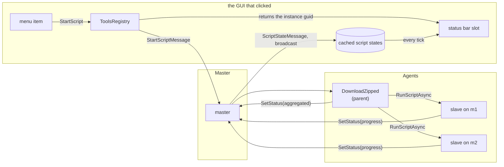

# Scripts

Dirigent can run user-provided C# scripts.

Script is a C# class dynamically compiled and started on given Dirigent node (agent, master, UI).

Scripts allows for running a user specific code utilizing the Dirigent API. This allows the user to implement whatever logic of controlling the applications, including complex multi-machine stuff.

Scripts can

* Access all features of the dirigent (starting apps, plans, other scripts etc...)
* Respond to certain conditions (some machine boots up, some app starts/dies etc.)
* Define own sequences of actions
* Take parameter (once when the script starts), a single string, can be JSON
* Update status (as long as running)
* Return result (arbitrary text string, can be JSON)


## Script example
Please see the [DemoScript1.cs](../src/Dirigent.Common/Scripts/DemoScript1.cs) source file

## Script Status

Script status is described by a status code and additional details (short text description and a stringized data).

| Status Code | Status Text       | Data                 | Progress          | Description                           |
| ----------- | ----------------- | -------------------- | ----------------- | ------------------------------------- |
| Starting    | N/A               | N/A                  | N/A               | Script is being instantiated.         |
| Running     | Set by the script | Set by the script    | Set by the script | Script is running.                    |
| Finished    | N/A               | N/A                  | 1.0               | Script successfully finished.         |
| Cancelling  | N/A               | N/A                  | last reported     | Script is being cancelled.            |
| Cancelled   | N/A               | N/A                  | last reported     | Script was cancelled.                 |
| Failed      | N/A               | Serialized exception | last reported     | Exception was thrown from the script. |

The status text, data and progress can be set by the script at any time to provide more info on what the script is currently doing.

The status text is shown to the user on the Dirigent's UI.

The format of data string is script specific, can be JSON.

Progress is a `0.0` to `1.0` fraction, or null for "no idea how far" - see
[Publishing status and progress](#publishing-status-and-progress) for what to publish and
[Cancellation](#cancellation) for what a script must do to be interruptible.

## Remote Execution

Scripts can be started from starting machine but instantiated remotely on different target machine. The starting node can wait for the script to finish its job and to return the results.

WARNING: The script need to be available on the target machine!

## Arguments and results

A script can receive arbitrary arguments serialized in a single string. The script needs to know how to deserialize and to interpret the data. The caller needs to provide arguments that are compatible with the script being called.

A script can return a result back to the caller as a single string. The caller need to understand how to deserialize and interpret the results returned.

The script can use a built-in serialization/deserialization of argument/result data class via Newtonsoft Json. It takes all public fields of given C# class with the exception of those explicitly marked as ignored.

## Asynchronous nature

Scripts run asynchronously, i.e. they do not block other Dirigent operations.

As most parts of Dirigent run synchronously single threaded, the calls from the script to Dirigent's API get dispatched to Dirigent's main thread, causing the script to wait until the next tick.

This is why all the Dirigent API calls need to be awaited (like "await StartApp" or "await KillApp").

WARNING: The `await` in this case does not mean the script waits for the operation to finish. The operations like StartApp etc. are a fire-and-forget style. In such cases Dirigent waits just until the command is issued. You need to check the app/plan state if you need to know if it started successfully or not.

## Singleton scripts

 * Identified by unique GUID.

 * Run on dirigent master.

 * Can be preconfigured in SharedConfig.xml where script file path (denoting the script code) is specified together with optional script arguments.

 * Can also be defined on the fly via the [StartScript CLI command](CLI.md#StartScript) if the `path` is specified.

 * Exposed to the user via Dirigent's UI and Dirigent's CLI.

 * Can be started/killed in similar way as plans.
    * Can't be started twice at the same time.
    * If already running, next start is ignored.

 * Results are cached and can be retrieved by as part of the script state using GetScriptState API.

Singleton scripts can be used for example as "intelligent plans":

 * Startinig a buch of apps
 * Adding some user defined logic (waiting for machines to come online etc.)


## Script Operations

- **Start Script.** Starts given script, creating a script instance.
- **Kill Script.** Kills given script instance.
- **Get Script State.** Returns the status of one concrete script instance.
- **Get All Script State.** Returns the status of all singleton script instances known to Dirigent.

# Startup Script

Dirigent master can run on startup one of the scripts predefined in SharedConfig.xml like the following:

```
  <Script
    Id="22C526A2-6F7C-4B25-8233-7EF37619E1CB"
    Title="Run Plan When Machines Online [built-in]"
    Name="BuiltIns/RunPlanWhenMachinesOnline.cs"
    Args="{plan:'plan1', timeout:5}"
    Groups="Examples;Common/Demo"
  />
```

On dirigent master command line you specify the GUID of the script record om SharedConfig, and (optionally) you override the arguments:
```
--startupScript "22C526A2-6F7C-4B25-8233-7EF37619E1CB"
```

 Optionally you can override the default arguments specified in sharedConfig.xml. Notice the relaxed JSON syntax allowed by Newtonsoft Json parser used by Dirigent.
```
--startupScript "22C526A2-6F7C-4B25-8233-7EF37619E1CB" --startupScriptParams "{plan:'plan2', timeout:10}"
```

# Arguments are JSON

A script receives its arguments as a single string, and that string is **always JSON**
deserialisable into the script's own argument class - never free text for the script to pick
apart. Every caller then looks the same: an action in the shared config, a `StartScript` command
over the CLI or `POST /cli`, `--startupScript`, or another script. Newtonsoft's relaxed syntax is
accepted, so unquoted keys and single-quoted strings are fine:

```
StartScript <guid> BuiltIns/DownloadZipped.cs '{Node:{Id:"logs.all"}, ToMachine:"m1", Comment:"nightly"}'
```

The consequences are worth being deliberate about:

* A script declares a `TArgs` class and does `Tools.Deserialize<TArgs>( Args )`. Nothing parses
  strings, so nothing has to guess.
* Arguments that do not fit the class **fail the script**. `GetScriptState` reports `Failed` with
  the exception - far better than a script quietly running with defaults.
* On a command line, wrap the JSON in single quotes so its double quotes reach the script intact.
  JSON arrays are fine.
* A script returns JSON too, in `ScriptState.Data` - so define a `TResult` class and put in it
  everything a caller might want. A message box helps nobody driving the script from a script.

# Script API

## Assemblies available to the script:
 * System
 * log4net
 * Dirigent.Common
 * Dirigent.Agent.Core
 * Newtonsoft.Json

## Properties available to the script

``` c#
string Args; // string arguments passed to a script; usually json format

public CancellationToken CancellationToken; // signalled when the script is cancelled; script should check it during long operations
```

## Support methods

``` c#
string Serialize<T>( T? result ); // serialize an object into a json string
T? Deserialize<T>( string? json ); // parses json string (Newtonsoft JSON) and returns a new instance of given class
bool TryDeserialize<T>( string serialized, out T? args ); // json deserialization returning false on failure (if parameters are not json)

Task Wait( int msecs ); // cancellable wait

```

## Publishing status and progress

``` c#
Task SetStatus( string? text=null, string? data=null, double? progress=null ); // updates the script status, data & progress; don't use for returning results (use the return statement instead)
```

`progress` is a fraction, `0.0` to `1.0`. Passing `null` - the default - means *running, no idea
how far*: the GUI then sweeps an indeterminate bar rather than showing a number that is not true.
Publish the phase name in `text` whenever there is no number, so the indicator always says
something.

A finished script is set to `1.0` whatever it last reported, so an indicator ends full rather than
frozen wherever it got to.

Progress is deliberately **not** carried inside `data`: that is script-specific JSON, and the
status bar must not have to understand a particular script to draw a bar.

### Progress of a script that starts other scripts

Aggregating belongs in the script, not in the framework - only the script knows what "half done"
means for its own work. A parent holds its children's instance guids from
`RunScriptAsync`/`RunScriptNoWait`, polls them with `GetScriptStateAsync( guid )`, and publishes a
single number of its own. There are no parent/child links in the protocol and no tree walking in
the GUI.

`BuiltIns/DownloadZipped.cs` is the worked example: it weighs each machine by the bytes that
machine announced, so one holding a 60 GB log does not count the same as one holding 2 MB. See
[the phases of a download](Files.md#what-the-operator-sees-while-it-runs).



Every state is broadcast to every subscribed client, so a GUI shows a bar for exactly the scripts
whose guids it was handed - the slaves were started by the parent, not by a GUI, so no GUI has
theirs.

> Adding a field to `ScriptState` takes two edits, not one. `ReflectedScriptRegistry` copies the
> state field by field where every client caches it, so a field added only to `ScriptState` travels
> over the wire and is then dropped - and nothing ever sees it.

## Cancellation

`KillScript` cancels the `CancellationToken`, and that is all it does - `ScriptRunner` lets a script
that ignores its token run to the end. A script is interruptible only if it says so itself:

* **check the token inside long loops**, not only between them. A chunked copy that checks per chunk
  stops inside a huge file; one that checks per file stops minutes later.
* **clean up what was half done.** Build under a temporary name and move it into place when
  complete, so an interrupted run leaves nothing that looks finished.
* **kill the children.** Cancelling a parent does not touch the scripts it started; they carry on
  working. Send `KillScript` to each, and wait (bounded) for them to stop before removing anything
  they are still writing to - deleting a folder under a slave that is still writing fails, and the
  slave then recreates it for its own cleanup.

> `await Task.WhenAny( work, Task.Delay( period, token ) )` hands back the *cancelled delay* rather
> than throwing, so a wait built this way ignores its own cancellation and carries on to the end.
> Look at the token explicitly after the wait.

## App/Plan/Script API

Please refer to [Dirigent CLI](CLI.md) for more details.

Please note that:
 * Most of the actions (StartXX/KillXX) just send request and return immediately.
 * To check the result of such actions, you need to poll the status (GetXXXState).

``` c#

// apps

Task StartApp( string id, string? planName, string? vars=null );
Task RestartApp( string id, string? vars=null );
Task KillApp( string id );

Task<AppState?> GetAppState( string id );
Task<IEnumerable<KeyValuePair<AppIdTuple, AppState>>> GetAllAppsState();

Task<AppDef?> GetAppDef( AppIdTuple id ); // from SharedConfig
Task<IEnumerable<KeyValuePair<AppIdTuple, AppDef>>> GetAllAppsDef();

// plans

Task StartPlan( string id, string? vars=null );
Task RestartPlan( string id, string? vars=null );
Task KillPlan( string id ); // kills a plan 

Task<PlanState?> GetPlanState( string id );
Task<IEnumerable<KeyValuePair<string, PlanState>>> GetAllPlansState();

Task<PlanDef?> GetPlanDef( string id );  // from SharedConfig
Task<IEnumerable<PlanDef>> GetAllPlansDef();


// scripts

Task<ScriptState?> GetScriptState( Guid id );
Task<IEnumerable<KeyValuePair<Guid, ScriptState>>> GetAllScriptsState();

Task<ScriptDef?> GetScriptDef( Guid Id );  // from SharedConfig
Task<IEnumerable<ScriptDef>> GetAllScriptsDef();


// clients

Task<ClientState?> GetClientState( string id );
Task<IEnumerable<KeyValuePair<string, ClientState>>> GetAllClientsState();

```

## Script result

Script neeeds to return a string (or null).

The value is remembered and can be queried using `GetScriptState` as the `ScriptState.Data` field (if the `Status` == `Finished`).

