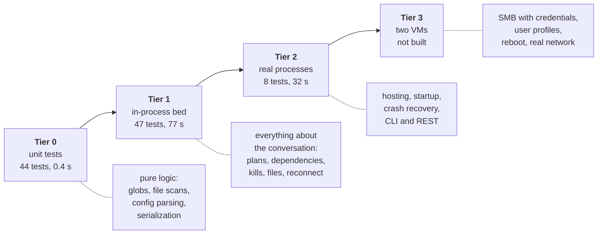
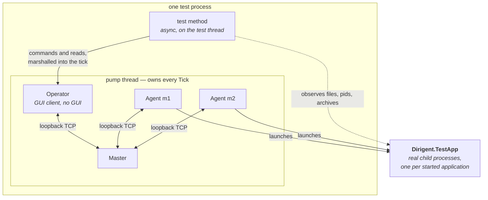
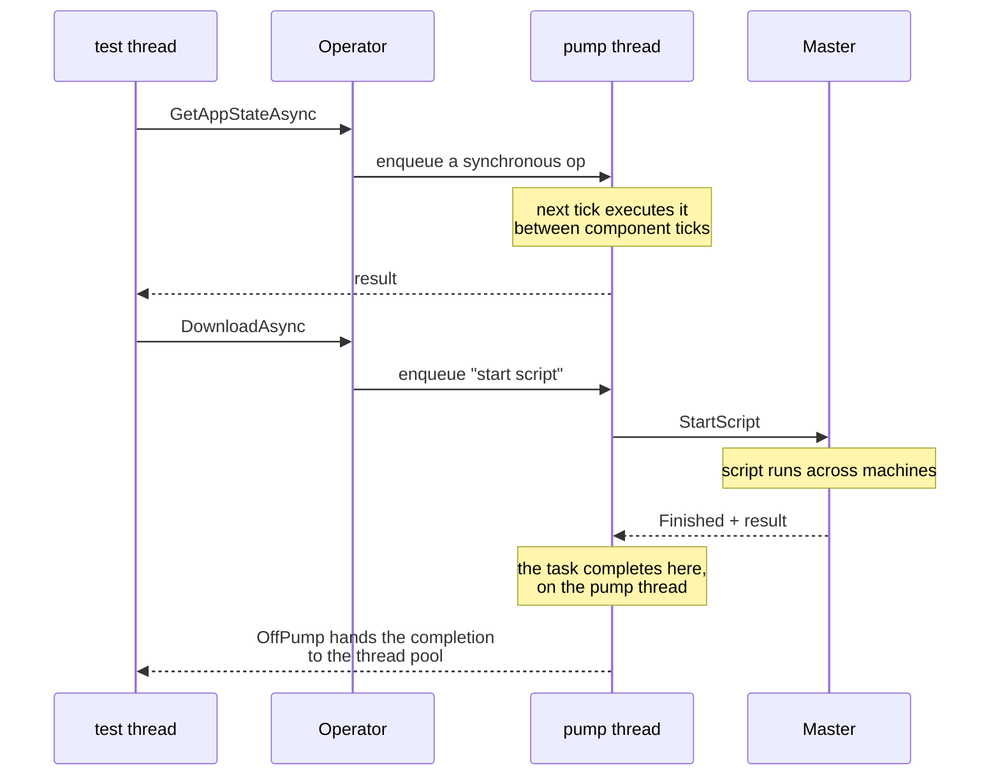
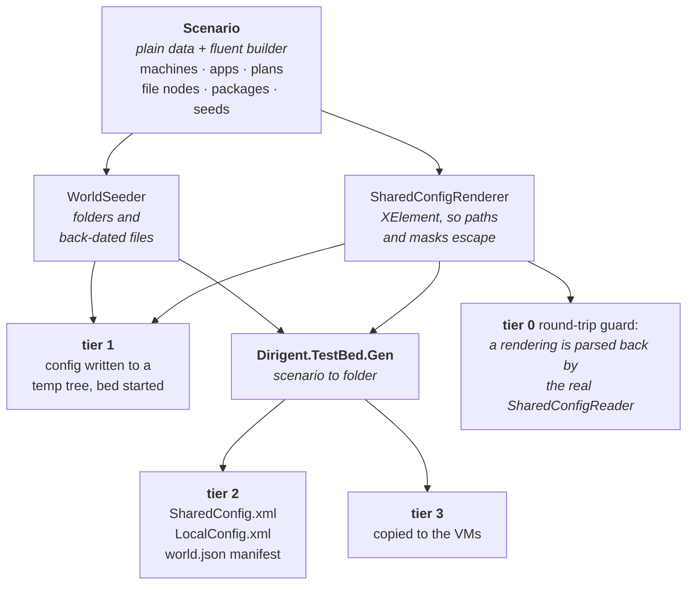
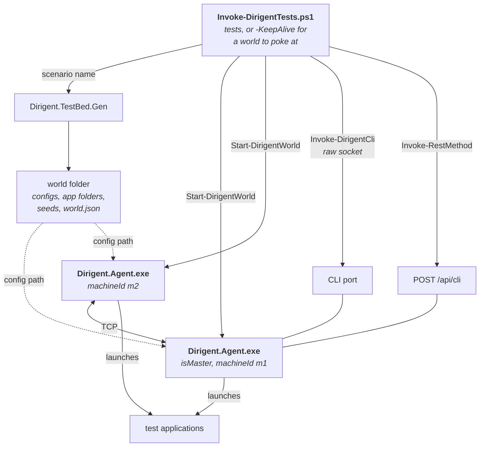

# Dirigent test harness — design

How Dirigent is tested, why it is arranged this way, what exists today, and what comes next.

This is the canonical design document for the harness; it supersedes the earlier "Rehearsal Room"
document. The practical how-to-run guides live next to the code:
[`src/Dirigent.TestBed/README.md`](../src/Dirigent.TestBed/README.md) for tier 1 and
[`src/Dirigent.TestBed.PowerShell/README.md`](../src/Dirigent.TestBed.PowerShell/README.md) for
tier 2.

Contents:

* [The problem](#the-problem)
* [Principles](#principles)
* [The tiers](#the-tiers)
* [Tier 1: the test bed](#tier-1-the-test-bed)
* [Describing a world once](#describing-a-world-once)
* [Tier 2: real processes](#tier-2-real-processes)
* [What exists today](#what-exists-today)
* [What it has found](#what-it-has-found)
* [The harness that was replaced](#the-harness-that-was-replaced)
* [Roadmap](#roadmap)
* [Standing constraints](#standing-constraints)

## The problem

Dirigent is a distributed process orchestrator: a master, an agent per machine, GUI and CLI clients,
all talking over TCP. Almost everything interesting about it involves **more than one process on more
than one machine** — a plan launching applications in dependency order across machines, an agent
losing its connection and adopting its applications when it returns, a bundle of log files collected
from every machine into one archive.

That shape defeats ordinary unit testing. The behaviour worth checking is not inside a class, it is
in the conversation between components. Two consequences shaped everything here:

* **A bug can be invisible until the field.** The file subsystem had been written, lightly tried by
  hand, and shipped disabled. It contained a wrong sort order, colliding archive names, a reference
  form that could never resolve, and a destination path that came back with its variables
  unexpanded. Nothing was subtle; nothing had ever been exercised end to end.
* **Manual testing does not scale to a matrix.** The old workflow was a pair of batch files —
  `run_m1_gui_master.bat`, `run_m2_con.bat` — a hand-written config, and a person clicking. That
  finds the bug in front of you, once.

The harness exists to make the conversation between processes cheap to set up, cheap to observe, and
impossible to leave running afterwards.

## Principles

**1. Real components, real sockets, fake nothing.** No mock of the master, no in-memory transport.
Tier 1 runs the actual `Master`, the actual `Agent`s and a real client over loopback TCP inside one
process. What is faked is only the *world*: the applications launched are a controllable stand-in,
and the folders are temporary. If a test passes because a mock agreed with the code, it has told us
nothing.

**2. No sleeps, ever — wait for conditions.** There is no virtual time in Dirigent: `Clock` is a
wall-clock singleton and components pace themselves with `Stopwatch`. A fixed sleep is therefore a
guess about somebody else's machine, and guesses fail under load. Everything waits on a condition
with a timeout and a *reason*, and a timeout prints the whole world's state.

The one exception is a **negative** property — "it was *not* restarted" — which has no event to wait
for. Those are checked by observing for a bounded window, which cannot be flaky: it fails only if
the thing being ruled out actually happens.

**3. Every run is isolated, and proves it left nothing behind.** Free TCP ports, its own config
files, its own agent-status and download folders, its own temp tree. Two runs cannot collide, and a
run cannot touch the real Dirigent installation on the developer's machine. Teardown kills what the
run started — including process trees — and the suite asserts that no process and no folder
survives, because a green run that leaks is a green run that will eventually fail somebody else's.

**4. One description of a world, several renderings.** A scenario is plain data with a fluent
builder. The same description becomes an in-process bed at tier 1 and a folder full of real config
files at tier 2. Nothing about a world is written twice, in two languages, to drift apart.

**5. Tests read like statements about the product.** `DependentApplicationWaitsUntilItsDependencyIsInitialized`,
not `TestPlan3`. A test names a promise Dirigent makes; when it fails, the name is the bug report.

**6. Cost decides the tier.** A behaviour is tested at the cheapest tier that can show it. Breadth
belongs at tier 1, where a test costs a second or two. Tier 2 is reserved for what only real
processes can show, and stays deliberately small.

**7. Don't disturb the human at the keyboard.** Applications start minimized by default, and a run
must never steal focus. A test suite that interrupts work does not get run.

## The tiers



| Tier | What runs | What it can show | What it cannot |
| --- | --- | --- | --- |
| **0** | classes under test | pure logic and parsing | anything about processes or the network |
| **1** | master + N agents + a client, one process, loopback TCP | the whole orchestration, and the file subsystem end to end | that the shipped executables start; a real SMB hop |
| **2** | the shipped `Dirigent.Agent.exe`, one process per machine | hosting and configuration discovery, post-crash recovery, both remote-control surfaces | anything needing a second machine |
| **3** | two VMs | shares with credentials, distinct user profiles, a machine going away mid-operation, reboot | — |

## Tier 1: the test bed

One process holds the master, an agent per machine, and an *operator* — a GUI client with no GUI.
They talk over real loopback TCP. A single **pump thread** ticks them, because every Dirigent
component is single-threaded by design and expects to be ticked from one place.



### The two threading rules

Both exist because the components are single-threaded, and both were learned by getting them wrong.

**Read state only through the operator.** It marshals each call into the pump's tick through
`SynchronousOpProcessor`, so a read never lands mid-tick. Touching the state repository from the test
thread is what produces "collection was modified" flakiness.

**Hand a script's completion back to the thread pool.** A script result is delivered from inside the
tick, and `ReflectedScriptRegistry` completes its task right there — so awaiting it directly moves
the *rest of the test body* onto the pump thread. The next `Dispose` then waits five seconds to join
a thread that is itself, the survivor scan times out, and applications leak. `Operator.OffPump`
exists for exactly this.



### Teardown

Dirigent deliberately leaves managed applications running when an agent goes away — right in
production, wrong in a test. So the bed:

1. notes every pid the agents report running, **every tick** — not at teardown, and not from the
   operator, whose view lags behind a test that finishes on a file appearing;
2. stops the pump;
3. disposes the operator, the agents and the master;
4. kills the noted pids **and their process trees**, after checking each process really is the test
   application, since a stale pid may belong to something else by then;
5. deletes the temp tree.

The test application also gives up a minute after its parent disappears, so a kill that fails cannot
leave an orphan nobody can identify.

## Describing a world once

A *scenario* is plain data — machines, applications, plans, VFS nodes, packages, files that must
already exist with a controlled age — with a fluent builder over it and presets for the common
worlds. It is rendered, never hand-written.



Two things make this trustworthy rather than merely tidy:

* **The renderer is guarded by the product's own parser.** `ScenarioRenderTests` renders a scenario
  and feeds the result through the real `SharedConfigReader`, asserting that what comes out the far
  end is what the scenario asked for. A rendering Dirigent would reject fails at tier 0, in half a
  second, rather than as a puzzling integration failure.
* **A test states only its delta.** `Scenario.TwoMachinesWithIdlers().App( "m1.quitter", a => a.ExitsAfter( 0.5 ) )`
  — the preset carries the boring part, the test carries the part it is about.

A scenario also knows things the config cannot express: which files must exist and **how old** they
are. That is how "collect the logs of the last two days" is testable at all — the world is seeded
with a file from yesterday and one from nine days ago, and the archive must contain exactly one of
them.

## Tier 2: real processes

The same worlds, rendered to disk and driven from PowerShell over the command-line interface — the
road an operator or a CI job takes. Windows PowerShell 5.1, nothing to install.



Tier 2 is small on purpose — eight tests: the world comes up; an application starts and stops on the
right machine; an agent killed hard adopts its applications when it returns; the file nodes can be
listed, resolved on another machine, and collected into one archive; the web server answers the same
commands; and a run leaves nothing behind.

`-KeepAlive -WithGui` replaces the old batch-file workflow: it builds a curated world, starts the
master as a tray GUI, prints the ports and ids, and binds the world to `$w` so it can be driven by
hand with the same verbs the tests use.

### Files need no commands of their own

A useful discovery, and the reason tier 2 needed less than planned. Three new CLI commands were
designed — `GetAllVfsNodes`, `ResolveVfsNode`, `DownloadVfsNode`. None was needed: `StartScript`
plus `GetScriptState` already carry everything, because arguments are JSON and results come back in
`ScriptState.Data`.

What was missing was not a command but the ability to *name* a node from outside, since only a GUI
can hand a script an already-resolved node tree. So the VFS scripts take a selector — the same
id/machine/app triplet a `<FileRef>` uses — and resolve it themselves:

```
StartScript <guid> BuiltIns/DownloadZipped.cs '{Node:{Id:"logs.all"}}'
GetScriptState <guid>
```

## What exists today

| Piece | What it is |
| --- | --- |
| `src/Dirigent.TestApp` | the controllable stand-in application: runs forever, exits with a code, writes logs, reports its environment, refuses to close, spawns children, gives up when orphaned |
| `src/Dirigent.TestBed` | the tier-1 bed: temp world, ports, pump, components, teardown; the `Operator`; the scenario model and renderers; `CliSession` |
| `src/Dirigent.TestBed.Gen` | renders a scenario preset to a folder, with a `world.json` manifest |
| `src/Dirigent.TestBed.PowerShell` | the tier-2 driver, its tests, and its own README |
| `src/Dirigent.IntegrationTests` | 47 tier-1 tests |
| `src/Dirigent.CommonTests` | 44 tier-0 tests, including the scenario round-trip guard |

Tier-1 coverage by area:

| Area | Tests |
| --- | --- |
| app control and routing | `AppControlTests` — 5 |
| plans, dependencies, init detectors, plan status | `PlanTests` — 7 |
| restart on crash, kill tree, soft kill, environment | `AppLifetimeTests` — 6 |
| config reload, reconnect, post-crash adoption | `ReloadAndReconnectTests` — 5 |
| the file subsystem by id, without a GUI | `VfsScriptTests` — 8 |
| the log download, end to end | `LogDownloadTests` — 3 |
| the CLI surface over a real socket | `CliSurfaceTests` — 6 |
| the harness's own promises: isolation, no leaks | `HarnessTests` — 6 |
| launch variables not surviving into the next launch | `LaunchVariableTests` — 1 |

### What Dirigent had to grow

Every seam added for testability is a setting a real deployment can also use:

| Change | Why |
| --- | --- |
| `--agentStatusFolder` | so a run cannot touch the machine-global recovery file of the real installation |
| `--downloadFolder` | so a download lands in the run's temp tree, not the user's Downloads |
| `IDirig.MachineId` | the master knows its machine even though it has no client name; a script could not ask before |
| `VfsNodeSelector` on the VFS scripts | so anything without a GUI can name a node by id |
| `DownloadZipped.TResult` | it was an empty class: a scripted download could not tell success from failure |
| `ToMachine` on a download | a caller that is on no machine can say where the files should land |

## What it has found

The harness has paid for itself in bugs, every one of them in code that had been written and never
exercised end to end.

**In the file subsystem** — all of it dead code in the field, so free to fix:

* `Filter="Newest"` returned the *oldest* files.
* Per-machine archives collided, so a download from several machines lost all but one.
* `<FileRef MachineId="*">` was dispatched for resolution to a machine literally named `*`, so a
  package gathering files from every machine could never resolve — the headline use case.
* A download's destination was resolved with `forceUNC`, so even a slave on the machine owning the
  folder copied through `\\ip\share\...`, and a deployment with no share could not download at all.
* Global files were assigned to the first machine in the list even when no slave ran there.
* A download requested by anything that is not an agent or a GUI resolved its destination to the
  literal `%DOWNLOADS%`: the lookup fell back to the client name, which is empty on the master, and
  an empty machine id means "global" to the resolver, which returns the path unexpanded.

**Elsewhere in the product:**

* **A config-file handle leak.** `LoadSharedConfig`, `LoadLocalConfig` and `InitFromLocalConfig` all
  did `File.OpenText` without disposing — a leak on every reload, found because temp folders would
  not delete.
* **`AppConfig` assigned `RootForRelativePaths` to `Mode`**, so passing that option broke the mode.
* **The CLI parsed the request id greedily** up to the *last* `]` in the line, so any request
  carrying a JSON array had its tail chopped off and parsed as another command.
* **The config validator disagreed with the runtime about dependencies.** A dependency written
  without a machine was rejected at load although `AppLaunchPlanner` resolves that form at run time;
  the circular-dependency check had the same parse, so a cycle written with bare names went
  undetected.
* **An agent dies if `LocalConfig.xml` is missing** — left as it is, since a real deployment has
  one, but now known and documented.
* **`--httpPort 0` does not disable the web server**, it falls back to 8877; `-1` disables. Two
  installations on a machine would fight over that port. `docs/HTTP.md` also had the default wrong.

**And in the harness itself**, twice, which is the same discipline turned inward. A test that
waited for a file to *exist* and then read it could see it half-written, because the test
application wrote in place; it now writes beside the target and moves it into position, so
appearing and being complete are the same event. And teardown depended on
state having reached the operator, so a test finishing on a file appearing left five applications
and eleven temp folders behind a green run.

## The harness that was replaced

Branch 3.1 carried a second, mock-based harness - `MockLauncher` / `MockProcess` /
`MockProcessManager`, an injectable `IMasterServer`, and a `DeterministicScenarioTest` that carried
messages between master and agent by hand and injected them through reflection on a private method.
It was removed when the branches were merged. The reasoning, so it is not re-litigated later:

* **Its coverage was subsumed.** Every assertion it made - defs reaching a client, a plan starting
  both applications, a crash being noticed, disconnect detection, adoption with an unchanged pid -
  is made here with real messages and real processes. The one exception, that a plan restart must
  not carry the previous launch's variables, is now `LaunchVariableTests`, asserted where it
  matters: in the environment the process is actually given.
* **It bypassed the transport.** Serialization, `Server`/`Client`, subscription categories,
  reconnect - none of it ran. The test itself carried each message, so it verified the sequence its
  author had in mind rather than the one the code produces.
* **It coupled tests to internals** - reflection on a private method, and assertions that depended
  on how many ticks were driven.
* **Its 146-line `IntegrationTestHarness` was dead code**; nothing referenced it.

A mocked-process lane was then built here, briefly, to keep its one real advantage: ending a
process at an exact instant, between two ticks. It was removed too, after measuring. **The lane was
not meaningfully faster** - 1-2 s per test either way, because bringing the bed up dominates, not
launching a process - and no test needed the timing precision, since waiting on a condition absorbs
the milliseconds a real kill takes. What remained was a second launcher that production never uses,
a second place for a test to live, and three tests duplicating coverage. Not worth its keep.

The product seams that existed only to support it went with it: `IMasterServer` and the internal
`Master( SharedConfig, ... )` constructor, the launcher factory threaded through `Agent`,
`LocalAppsRegistry` and `LocalApp`, the ten `Launcher` members opened up for overriding, and the
`DIRIGENT_SERVER_LOCAL_ONLY` environment variable that `Server` read - test-only behaviour has no
business in shipping code. All of it was compile-time only, and the revert was verified file by
file against the state before that commit: `Launcher.cs` and `LocalAppsRegistry.cs` byte-identical,
`LocalApp.cs` and `Server.cs` identical but for whitespace, `Agent.cs` differing only by the
harness's own seams - the configurable status and download folders, and a config-file handle leak
fixed along the way.

Should a mocked lane ever be wanted again, the seams are three lines of `git revert` away, and this
section says what to weigh before bringing them back.
## Roadmap

### Next

**Breadth, continued at tier 1.** The areas not yet covered, cheapest first:

* **Init detectors beyond `timeout`** — `exitcode` is used once, `WindowPoppedUp` not at all.
* **Plan sequencing details** — `SeparationInterval`, `StartTimeout`, retry after a failed launch,
  several plans over the same applications, `ApplyPlan`.
* **`KillAll`, `Shutdown`, `Terminate`** and the flags they set.
* **Scripts as a feature** rather than as a means: `StartScript` on an agent, cancellation,
  `KillScript`, a script's exceptions reaching the requestor.
* **The web API surface** — tier 1 covers the CLI over a real socket; the REST controllers are only
  smoke-tested at tier 2 through `POST /api/cli`.
* **Machine actions and tools** — `ToolsRegistry`, `FolderWatcher` in the local config.

**A second tier-2 world.** Everything at tier 2 runs `LoggingWorld`. A plan-driven world would cover
the launch sequencing through the real hosting model.

### Later

**Tier 3, on the two VMs.** The `config/VM` scaffolding exists; the generator and the PowerShell
verbs are reusable. Only this tier covers a real SMB hop with credentials, distinct user profiles, a
machine going offline mid-download, and reboot. Deliberately deferred — everything cheaper should be
covered first.

**Continuous integration.** Tiers 0 and 1 are a natural gate on every commit; tier 2 needs a Windows
runner and is a nightly. Nothing in either depends on the developer's machine, which was a design
goal rather than a happy accident.

**A crash-triggered collection.** The pieces now exist — a `FolderWatcher` in the local config can
run a script, and a download reports its archive path in its result. That was impossible while the
path lived only in a message box.

### Deliberately not planned

* **A mock transport or a fake master.** The point is the conversation; faking it removes the thing
  being tested.
* **Virtual time.** It would mean changing how every component paces itself, to remove waits that
  condition-based waiting already handles.
* **UI automation of the WinForms GUI.** The operator client covers what the GUI *asks Dirigent to
  do*; clicking pixels is a different discipline for a much smaller return.

## Standing constraints

* **Compatibility first, outside the VFS.** Dirigent is deployed. Prefer new optional settings, new
  commands, new overloads whose defaults reproduce today's behaviour exactly. Avoid changing wire
  messages, existing command responses, or the meaning of existing fields — *avoid*, not "do
  carefully". The file/package subsystem is the exception: never used in the field, so its shape may
  change freely, though its config attributes stay backward compatible because example configs
  circulate.
* **Two agents can share an address.** In a tier-1 bed every machine is `127.0.0.1`, so any logic
  identifying a machine by address is ambiguous there. The download reads the operator's machine from
  the client-name prefix for that reason; the same pattern may exist elsewhere and is worth a grep
  rather than an assumption.
* **A test that leaks is a bug in the test.** Not an inconvenience: the next run inherits it, and the
  build starts failing for reasons nobody can reproduce.
